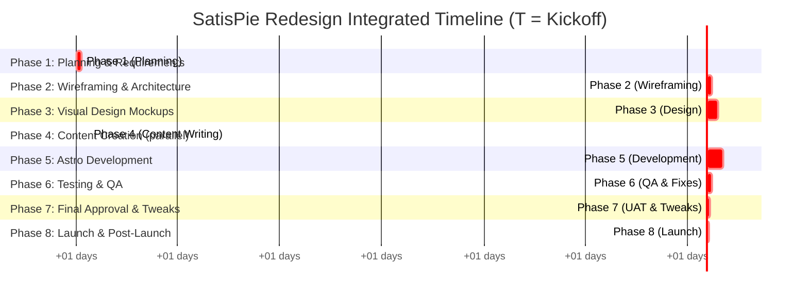

Great—I'll generate a complete execution roadmap for the SatisPie website redesign, using the uploaded Implementation Plan as the authoritative reference.

This will include all required deliverables: a Master Roadmap with phases and batches, Work-Breakdown Structure, RACI Matrix, Phase Gate Checklists, Gantt-style Integrated Timeline, Risk Register, and Communications Plan.

I’ll let you know as soon as the full execution package is ready.

# SatisPie Website Redesign – Execution Roadmap

## 1. Master Roadmap

**Hierarchical Phase & Batch Outline:** The project is organized into 8 sequential phases, each with clear objectives and subdivided into numbered batches (sprints) for incremental delivery. Each batch lists its start and end as offsets from project kickoff (T), exit criteria, and any prerequisites or dependencies.

1. **Phase 1: Planning & Requirements Gathering** – *Objective:* Establish project foundation (scope, content needs, technical approach).

   * **Batch 1.1 – Content Audit & Ideation** (Start: T + 0 days, End: T + 5 days): Review all existing site content, decide what to update or create anew; gather design inspirations and define style elements (palette, fonts, high-res logo).
     *Exit Criteria:* Content inventory completed; list of new content to write; moodboard/design reference compiled.
     *Dependencies:* Project kickoff complete; access to current site/content. *Prerequisites:* Stakeholder goals & brand assets provided.
   * **Batch 1.2 – Scope Definition & Tech Planning** (Start: T + 5 days, End: T + 7 days): Finalize in-scope features (e.g. confirm **Where to Buy** locator, newsletter, Careers page); determine technical approach for any complex features (store locator method, form handling), noting any API keys or environment needs.
     *Exit Criteria:* Features list baseline (what’s in/out) signed off; technical strategy documented (e.g. Google Maps usage decided, env variables noted).
     *Dependencies:* Batch 1.1 completion (content & ideas inform scope). *Prerequisites:* None (use initial requirements).

2. **Phase 2: Wireframing & Architecture** – *Objective:* Define site structure and low-fidelity UX for all pages.

   * **Batch 2.1 – Site Map & Wireframes** (Start: T + 8 days, End: T + 12 days): Confirm final site map/navigation, including new pages like “Where to Buy” and “About Us”. Create low-fi wireframes for key pages (Home, Products, Tips listing, About, Contact) focusing on layout and content placement.
     *Exit Criteria:* Approved site map diagram; wireframes sketched for all main page layouts.
     *Dependencies:* Phase 1 completion (scope & content needs). *Prerequisites:* Proposed site structure from implementation plan.
   * **Batch 2.2 – Review & Component Plan** (Start: T + 12 days, End: T + 14 days): Team/stakeholder review of wireframes and site structure; incorporate feedback to ensure consensus (avoids later rework). Plan Astro component architecture (header, footer, product card, etc.) needed for templates.
     *Exit Criteria:* Wireframes and navigation accepted by stakeholders; list of required Astro components documented.
     *Dependencies:* Batch 2.1 wireframes complete. *Prerequisites:* Alignment on branding and functionality from Phase 1.

3. **Phase 3: Visual Design Mockups** – *Objective:* Create high-fidelity UI designs for the site’s look and feel.

   * **Batch 3.1 – High-Fidelity Page Designs** (Start: T + 15 days, End: T + 22 days): Develop polished mockups for main pages (homepage first, then others) using chosen colors, imagery placeholders, and typography. Design all UI elements (buttons, forms, etc.) to meet modern, professional quality.
     *Exit Criteria:* Pixel-perfect mockups of all key pages (desktop) completed in Figma (or similar), ready for review.
     *Dependencies:* Phase 2 approval (site structure). *Prerequisites:* Brand style guide (colors, fonts), hi-res logo, reference websites for quality benchmark.
   * **Batch 3.2 – Responsive & Assets Prep** (Start: T + 22 days, End: T + 27 days): Design how layouts adapt to mobile (e.g. mobile menu, homepage). Conduct a design review with stakeholders to ensure the visuals meet the quality bar (compare against Sara Lee/Edwards sites) and adjust as needed. From finalized designs, compile a list of all required image assets with dimensions and notes (hero images, product photos, etc.).
     *Exit Criteria:* Mobile-responsive variations confirmed; all design mockups approved; asset checklist (with specs) completed.
     *Dependencies:* Batch 3.1 designs done. *Prerequisites:* Access to stock or product photos for mockups; stakeholder availability for design review.

4. **Phase 4: Content Creation** – *Objective:* Write and prepare all website copy and content in parallel with design.

   * **Batch 4.1 – Copywriting & SEO** (Start: T + 15 days, End: T + 23 days): Draft all page content (taglines, product descriptions, tips articles, about us story, form intro text) following the agreed tone/voice. Review and proofread content with stakeholders for accuracy (no typos, factual correctness). Incorporate SEO keywords strategically into copy (e.g. “pre-baked pies wholesale”) without sacrificing readability.
     *Exit Criteria:* All website copy written, reviewed, and approved; content is optimized for SEO and messaging.
     *Dependencies:* Phase 1 content audit (knowing what to write/update). *Prerequisites:* Final site map/wireframes (to know content needed per page).
   * **Batch 4.2 – Content Finalization & Entry Prep** (Start: T + 23 days, End: T + 27 days): Finalize any remaining content edits and obtain sign-off from Product Owner. Prepare content for integration – e.g. format tip articles in Markdown, organize product info in JSON – so that development can easily incorporate it.
     *Exit Criteria:* All content files (Markdown/JSON) ready for developers; content approval sign-off obtained.
     *Dependencies:* Batch 4.1 initial content drafted. *Prerequisites:* Phase 3 design (for context of content length/fit), style guide for tone consistency.

5. **Phase 5: Development (Astro Implementation)** – *Objective:* Build the site front-end per designs using Astro 5 and Tailwind CSS; integrate all content and features.

   * **Batch 5.1 – Project Setup & Global Components** (Start: T + 28 days, End: T + 32 days): Set up Astro project environment (ensure Astro v5, Tailwind, etc., are installed and up-to-date); create a new Git branch for the redesign. Implement global layout components: build `src/components/Header.astro` with new menu (including links to Where to Buy, About), adding a responsive mobile nav (hamburger toggle via Alpine.js or CSS). Build `src/components/Footer.astro` with redesigned footer (newsletter signup form, social icons). Update Tailwind config (brand colors, fonts) and global styles to match the design system. *(Dark mode and RTL support are out of scope, disabled if present).*
     *Exit Criteria:* Astro development environment running; header and footer components in place and responsive; global theme styles configured.
     *Dependencies:* Phase 3 design assets (logo, brand colors). *Prerequisites:* Repo access and dev environment tools.
   * **Batch 5.2 – Page Templates Implementation** (Start: T + 32 days, End: T + 40 days): Develop each page per the approved mockups, integrating real content:

     * **Homepage (`index.astro`)** – Build sections (hero, product highlights, tips teaser, etc.) with semantic HTML and Tailwind classes. Use placeholder or sample images (to be replaced with finals). Implement hero carousel (2–3 slides max) with a lightweight script, and embed or stub an Instagram feed section. Ensure prominent “Where to Buy” call-to-action.
     * **Products Page** – Create `src/pages/products.astro` (or `branded-products.astro`) and loop through product data to display all offerings in a responsive grid. Use thumbnails and names, leaving space for descriptions. Include category sections (Pies, Waffles, etc.) or filters if needed; consider pagination if the list grows long.
     * **Tips & Tricks Listing** – Build `src/pages/tips-and-tricks.astro` to list all tip articles. Each entry shows title, thumbnail, and excerpt, linking to its detail page. Implement as a blog index (Astro Content Collections or Markdown for tips).
     * **Tip Detail Pages** – For each tip (e.g. “how-to-slice-a-pie”), create a Markdown or `src/pages/tips/[slug].astro` page containing the article content. Ensure the template includes the article title, content (with subheadings, images), and author/date if applicable. Add a footer or sidebar suggesting related tips or a share button.
     * **Where To Buy** – Build `src/pages/where-to-buy.astro` with a ZIP code search form and results area. Initially, use either an embedded store locator widget (iframe) or a static list of stores by region as a fallback. Document the plan for a Google Maps API integration if needed later.
     * **About Us** – Implement `src/pages/about.astro` with headings and narrative text telling the SatisPie story. Insert images at appropriate spots (e.g. a hero banner or timeline photos) to enrich the story. If multiple milestones are mentioned, consider a simple timeline layout (CSS-based) for visual appeal. Highlight quality certifications (SQF, HACCP) with icons or badges.
     * **Contact Us** – Build `src/pages/contact-us.astro` containing a contact form (Name, Email, Phone, Message) styled with Tailwind forms. Connect the form action to the Formspree endpoint (temporary/test project key initially). Test form submission in dev to ensure emails send (use a test Formspree project). Also display contact info (address, email, phone) alongside or above the form, possibly with a small map icon next to address.
     * **Careers (Apply Today)** – Implement `src/pages/apply-today.astro` for job applications (if in scope). This form is longer; organize fields into two columns on desktop to avoid an excessively long page. The form submission also goes to Formspree (use a separate endpoint to distinguish job applications). Ensure mobile layout is user-friendly (stacked fields). After submission, show a confirmation message or redirect to a simple `thank-you.astro` page.
       *Exit Criteria:* All page templates are completed and styled per design; forms and interactive elements work in dev; placeholder images marked for replacement.
       *Dependencies:* Batches 5.1 (global components) and Phases 3–4 (approved design & content). *Prerequisites:* Finalized content files from Phase 4; design assets (images, icons) or placeholders.
   * **Batch 5.3 – Integration & Pre-QA Check** (Start: T + 40 days, End: T + 44 days): Add remaining global elements and clean up codebase. Implement a custom 404 page (`src/pages/404.astro`) with friendly message and link home. Remove any boilerplate files not used. Ensure SEO metadata (titles, meta descriptions) is set for each page (via Astro frontmatter or config). Generate a sitemap and verify all pages are included. During development, run accessibility checks (Lighthouse audit for color contrast, missing alts, etc.) and fix issues as you go. Perform a self-QA: click through the site in local build to catch obvious issues before formal testing.
     *Exit Criteria:* Codebase is production-ready (clean, with meta tags, sitemap); no known accessibility issues (Lighthouse score acceptable); developer self-QA passed.
     *Dependencies:* Batches 5.1 and 5.2 complete. *Prerequisites:* Phase 3 asset list (to ensure all images accounted for), content from Phase 4.

6. **Phase 6: Testing & QA** – *Objective:* Verify the site’s quality (functionality, compatibility, performance) and fix defects.

   * **Batch 6.1 – Full QA Testing** (Start: T + 45 days, End: T + 49 days): QA team conducts comprehensive testing across browsers and devices – verify layout on Chrome, Firefox, Safari, Edge and mobile views. Test all functionality: submit forms (with test emails) to ensure success messages and Formspree integration work; exercise the carousel (auto-rotate, navigation arrows); test store locator with sample ZIP (or verify static store list accuracy). Check responsiveness by resizing screens – no elements should overlap or truncate. Click every internal/external link to catch any 404s or broken links. Run performance tests (Lighthouse/PageSpeed) – flag any heavy images or unminified JS for optimization. Validate SEO elements: unique `<title>` and meta description on each page, OpenGraph tags, and ensure the Google Analytics tracking code is present and firing (use Google Tag Manager or GA script with the provided ID). Finally, proofread the site content in situ to catch any typos or formatting issues that slipped through.
     *Exit Criteria:* All critical and high-priority bugs are identified and logged; preliminary performance and SEO checks are passed (or issues logged for fix); no lingering content errors.
     *Dependencies:* Phase 5 deployment to a testing/staging environment. *Prerequisites:* Completed site build (Phase 5); test environment or staging URL (if needed for external testers).
   * **Batch 6.2 – Bug Fixing & Verification** (Start: T + 49 days, End: T + 52 days): Development team fixes the issues found in Batch 6.1. This includes any visual or functional bug fixes, performance optimizations (compress images, tweak code), and final SEO tuning (e.g., add missing meta tags). QA re-tests the resolved issues and performs a regression test on critical paths.
     *Exit Criteria:* All test cases pass; zero open high-severity defects; site meets quality standards (performance, accessibility, SEO targets).
     *Dependencies:* Batch 6.1 test results. *Prerequisites:* Issue tracking system updated with test findings.

7. **Phase 7: Final Approval & Phase Gate** – *Objective:* Obtain stakeholder sign-off and make final tweaks before launch.

   * **Batch 7.1 – UAT & Stakeholder Review** (Start: T + 53 days, End: T + 55 days): Deploy the nearly-final site to a staging environment (or use Astro preview build) for stakeholders to experience it as end-users. The Sponsor and Product Owner perform User Acceptance Testing (UAT), verifying the site meets requirements and is visually on-brand. Collect any change requests or identify any last-minute issues.
     *Exit Criteria:* Stakeholders approve the site for launch (sign-off document received); UAT feedback addressed or scheduled (no blocking issues remain).
     *Dependencies:* Phase 6 (QA) complete with no showstopper bugs. *Prerequisites:* Staging URL or build accessible to stakeholders; test accounts for forms (so stakeholders can test safely).
   * **Batch 7.2 – Final Tweaks & Content Freeze** (Start: T + 55 days, End: T + 57 days): Implement any final changes from stakeholder review (e.g., minor content edits, spacing adjustments, last-minute fixes). Double-check that the site still meets the “polished design” benchmark – compare side-by-side with reference sites one last time. Once all tweaks are done, freeze content and code: merge the final approved changes into the main branch, preparing for launch.
     *Exit Criteria:* Codebase marked “release-ready”; final sign-off from Sponsor on go-live readiness.
     *Dependencies:* Batch 7.1 stakeholder feedback. *Prerequisites:* Sponsor approval to proceed to launch.

8. **Phase 8: Deployment & Launch** – *Objective:* Deploy the new site to production (IONOS) and conduct post-launch verifications.

   * **Batch 8.1 – Production Deployment** (Start: T + 58 days, End: T + 59 days): Merge the redesign branch into `main` and push to trigger IONOS static deployment. Verify build commands and environment variables are correctly set on IONOS (Astro prod build config matches expectations). Coordinate a switchover from the old site: take a backup of the current site (if not already) before deployment. Once deployed, perform a smoke test on the live production site (spot-check key pages, forms, and features in the live environment) to ensure nothing broke due to environment differences.
     *Exit Criteria:* New site is live on production URL; smoke tests pass (pages load, forms send, no glaring issues in prod). Old site safely archived or retrievable if rollback needed.
     *Dependencies:* Phase 7 complete (all approvals). *Prerequisites:* Credentials/access for production deployment; IONOS deployment pipeline configured.
   * **Batch 8.2 – Post-Launch Monitoring & Handoff** (Start: T + 60 days, End: T + 62 days): After launch, verify search engines are indexing the new site: submit the updated sitemap to Google Search Console and Bing (especially if URLs changed). Announce the new website on official channels – e.g. social media, press release, and kick off the newsletter sign-up outreach (if applicable). Closely monitor the site for a few days: check Google Analytics for traffic drop-offs or unusual user behavior, watch for any 404 errors or broken links in analytics reports. Confirm Formspree submissions are arriving properly (no form emails lost). Address any minor post-launch issues quickly (e.g., fix typos or broken links reported by users). Finally, hand over documentation to the client: provide style guides, how-to for adding new content, and a post-launch content schedule (to keep site content fresh as planned).
     *Exit Criteria:* Successful transition to steady-state: site is stable with no critical issues post-launch; search indexing in progress; stakeholders are informed how to maintain content going forward.
     *Dependencies:* Batch 8.1 (site live). *Prerequisites:* Google Analytics ID and access to Search Console; communication plan for launch announcements.

**Master Roadmap Summary Table:** The table below summarizes all phases and batches, with their timeframes, key exit criteria, and dependencies.

| **Phase (Objective)**                                                                         | **Batch (Sprint)**                                                                                                                                                                                                       | **Start – End (days)** | **Exit/Done Criteria**                                                                                                                                                        | **Key Dependencies & Prerequisites**                                                              |
| --------------------------------------------------------------------------------------------- | ------------------------------------------------------------------------------------------------------------------------------------------------------------------------------------------------------------------------ | ---------------------- | ----------------------------------------------------------------------------------------------------------------------------------------------------------------------------- | ------------------------------------------------------------------------------------------------- |
| **Phase 1: Planning & Requirements** *Establish scope, content needs, technical approach.* | **1.1 Content Audit & Ideation** – Review existing content; gather design inspiration.                                                                                                                                   | T + 0 → T + 5          | Content inventory; list of new/updated content; moodboard & style ideas ready.                                                                                                | Kickoff complete; access to current site/content.                                                 |
|                                                                                               | **1.2 Scope Definition & Tech Plan** – Finalize features in/out; decide store locator approach.                                                                                                                          | T + 5 → T + 7          | Feature list (store locator, newsletter, etc.) confirmed; technical strategy documented.                                                                                      | Output of 1.1 (content needs, ideas). Stakeholder goals clarity.                                  |
| **Phase 2: Wireframing & Architecture** *Define site structure and low-fidelity UX.*       | **2.1 Site Map & Wireframes** – Draw final site map/nav; sketch layouts for key pages.                                                                                                                                   | T + 8 → T + 12         | Approved site map with all pages; low-fi wireframes for Home, Products, Tips, About, Contact.                                                                                 | Phase 1 done (confirmed scope/content). Reference site structure.                                 |
|                                                                                               | **2.2 Stakeholder Review & Comp. Plan** – Iterate wireframes per feedback; list required Astro components.                                                                                                               | T + 12 → T + 14        | Wireframes & nav accepted by stakeholders; component architecture defined (header, footer, etc.).                                                                             | Output of 2.1 (wireframes ready). Stakeholder availability for review.                            |
| **Phase 3: Visual Design Mockups** *Create high-fidelity UI designs.*                      | **3.1 Hi-Fi Page Designs** – Design polished mockups for all main pages (desktop focus).                                                                                                                                 | T + 15 → T + 22        | Figma mockups completed for homepage and all key pages; visual design meets quality benchmarks.                                                                               | Phase 2 sign-off (structure). Brand assets (logo, colors).                                        |
|                                                                                               | **3.2 Responsive & Assets Prep** – Design mobile views; stakeholder design review and tweaks; compile image asset list.                                                                                                  | T + 22 → T + 27        | Mobile-responsive design validated; all designs approved; image/asset requirements list finalized.                                                                            | Output of 3.1 (desktop designs). Stock product images or placeholders.                            |
| **Phase 4: Content Creation** *Write and prepare all site content.*                        | **4.1 Copywriting & SEO** – Draft page copy, tips articles; review content for accuracy; optimize for SEO keywords.                                                                                                      | T + 15 → T + 23        | Complete set of page contents (tagline, about story, product info, tips) written and approved; content is proofed and SEO-enhanced.                                           | Phase 1 content audit (knowing required content). Site map/wires to guide content needed.         |
|                                                                                               | **4.2 Finalize & Prep Content** – Incorporate final edits; prepare Markdown/JSON files for tips, products for easy dev integration.                                                                                      | T + 23 → T + 27        | All text finalized and signed off; content files (e.g. Markdown for Tips, JSON for products) ready in repo.                                                                   | Output of 4.1 (draft content). Agreed format for content (content model).                         |
| **Phase 5: Development (Astro)** *Implement front-end in Astro; integrate content.*        | **5.1 Setup & Global Components** – Initialize Astro project (Astro v5, Tailwind); implement Header & Footer components per design (responsive); set brand colors/styles.                                                | T + 28 → T + 32        | Dev environment running; header/footer built and responsive; global Tailwind theme configured.                                                                                | Phase 3 outputs (logo, style guide). Dev environment access.                                      |
|                                                                                               | **5.2 Build Pages & Features** – Code all pages (Home, Products, Tips, About, Contact, Careers) following mockups, inserting content and placeholders as needed; implement interactive elements (carousel, forms, etc.). | T + 32 → T + 40        | All page templates implemented; site functionality complete (forms wired to Formspree, store locator integrated or stubbed); design and content accurately reflected in code. | Batches 5.1, Ph 3 (design) & Ph 4 (content) complete. Astro components identified (from Phase 2). |
|                                                                                               | **5.3 Cleanup & Pre-QA** – Build 404 page and finalize SEO metadata; remove unused code; run Lighthouse for accessibility and fix issues; developer self-QA of site.                                                     | T + 40 → T + 44        | Clean build with no console errors; basic SEO/meta in place; passes internal accessibility check; ready for formal QA.                                                        | Batches 5.1 & 5.2 done. Content and design final (to verify nothing missing).                     |
| **Phase 6: Testing & QA** *Test across browsers, devices; fix defects.*                    | **6.1 Cross-browser & Functional QA** – Test on Chrome/Firefox/Safari/Edge, mobile vs desktop; validate all forms, links, and features; run performance and SEO audits; proofread on-site content.                       | T + 45 → T + 49        | QA report with all bugs logged; site meets or exceeds performance and SEO baseline (no critical issues outstanding); content verified in context.                             | Phase 5 complete (site deployed to test env). Test cases prepared.                                |
|                                                                                               | **6.2 Bug Fixes & Regression** – Developers resolve reported bugs; QA re-tests fixes and does regression on critical paths.                                                                                              | T + 49 → T + 52        | All critical/high bugs fixed and re-tested; zero critical known issues; go/no-go meeting indicates “go” for UAT.                                                              | Batch 6.1 results (bug list). Dev resources available for quick turnaround.                       |
| **Phase 7: Final Approval & Tweaks** *User acceptance testing and final polish.*           | **7.1 Stakeholder UAT** – Deploy site to staging for Sponsor/Product Owner to review end-to-end; gather any change requests.                                                                                             | T + 53 → T + 55        | Stakeholder sign-off on site (or list of minor changes approved for action); UAT scenarios passed.                                                                            | Phase 6 passed (site is stable). Staging environment ready. Stakeholder availability.             |
|                                                                                               | **7.2 Final Tweaks & Sign-off** – Implement last changes from UAT (content tweaks, spacing, etc.); final comparison with reference sites for quality; freeze code for release.                                           | T + 55 → T + 57        | All UAT feedback addressed; Sponsor gives final go-live approval; codebase tagged as release-ready.                                                                           | Batch 7.1 feedback. All team members available to quickly fix and verify tweaks.                  |
| **Phase 8: Launch & Post-Launch** *Deploy to production and monitor.*                      | **8.1 Production Deployment** – Merge redesign branch and push to IONOS (trigger build); back up old site; conduct smoke test on live site.                                                                              | T + 58 → T + 59        | New site live on production; deployment successful (no errors); basic sanity checks on live site passed.                                                                      | Phase 7 complete (sign-offs). IONOS Git deploy setup verified.                                    |
|                                                                                               | **8.2 Post-Launch Monitoring** – Submit sitemap to search engines; announce new site via social/newsletter; monitor analytics and user feedback for 1–2 days; fix any post-launch issues promptly.                       | T + 60 → T + 62        | No critical post-launch issues; search indexing confirmed; initial user feedback positive; project closure with documentation handoff.                                        | Batch 8.1 deployed. Analytics access; communication channels prepared (social login, email list). |

## 2. Work-Breakdown Structure (WBS)

The WBS below itemizes all tasks by ID, organized under their parent Phase and Batch. Each task includes a brief description, the primary **Responsible** role, estimated effort, key inputs (with references to the Implementation Plan pages), expected outputs, and relevant tools or references.

| **Task ID** | **Parent ID** | **Task Description**                                                                                                                                                                                                                                                                                                                                                                                                                                                                                                                                                                                                                                                                              | **Role** (Resp.)                               | **Est. Effort** | **Key Inputs** (ref. Plan)                                                                                                                 | **Outputs** (Deliverables)                                                                                                                                                       | **Tools/Refs**                                |
| ----------- | ------------- | ------------------------------------------------------------------------------------------------------------------------------------------------------------------------------------------------------------------------------------------------------------------------------------------------------------------------------------------------------------------------------------------------------------------------------------------------------------------------------------------------------------------------------------------------------------------------------------------------------------------------------------------------------------------------------------------------- | ---------------------------------------------- | --------------- | ------------------------------------------------------------------------------------------------------------------------------------------ | -------------------------------------------------------------------------------------------------------------------------------------------------------------------------------- | --------------------------------------------- |
| **1**       | –             | **Phase 1: Planning & Requirements** *(Summary task)*                                                                                                                                                                                                                                                                                                                                                                                                                                                                                                                                                                                                                                             | *PM (Accountable)*                             | 40 h            | Project charter, stakeholder goals                                                                                                         | Phase 1 completion = vision & scope defined                                                                                                                                      | –                                             |
| **1.1**     | 1             | **Batch 1.1: Content Audit & Ideation** *(Summary)*                                                                                                                                                                                                                                                                                                                                                                                                                                                                                                                                                                                                                                               | *PM*                                           | 24 h            | Current site content, brand guidelines                                                                                                     | Phase 1.1 done = content inventory, design ideas                                                                                                                                 | –                                             |
| 1.1.1       | 1.1           | Audit existing site content for reuse/rewrite. Identify gaps (pages like FAQ, product details) to address.                                                                                                                                                                                                                                                                                                                                                                                                                                                                                                                                                                                        | Content Writer                                 | 8 h             | Existing website pages & PDFs; initial site map                                                                                            | Content audit document (list of all content to keep, update, create)                                                                                                             | Google Docs/Excel                             |
| 1.1.2       | 1.1           | Gather design inspiration and examples (moodboard). Compile competitor site features (navigation, hero, store locator, etc.) and visual cues.                                                                                                                                                                                                                                                                                                                                                                                                                                                                                                                                                     | UX Lead                                        | 6 h             | Reference sites (Sara Lee, GM, Edwards) analysis; brand assets (logo, colors)                                                              | Moodboard or slide deck of inspirational elements; design notes (preferred styles)                                                                                               | Figma, Pinterest                              |
| 1.1.3       | 1.1           | Identify branding elements: confirm color palette & fonts (already defined). Ensure high-res SatisPie logo is available.                                                                                                                                                                                                                                                                                                                                                                                                                                                                                                                                                                          | UI Designer                                    | 2 h             | Brand style guide (if exists); logo files                                                                                                  | Confirmed brand palette & typography; logo files ready for use                                                                                                                   | –                                             |
| 1.2         | 1             | **Batch 1.2: Scope Definition & Tech Approach** *(Summary)*                                                                                                                                                                                                                                                                                                                                                                                                                                                                                                                                                                                                                                       | *PM*                                           | 16 h            | Phase 1.1 outputs; initial requirements doc                                                                                                | Phase 1.2 done = feature list & tech plan                                                                                                                                        | –                                             |
| 1.2.1       | 1.2           | Finalize feature scope: determine which features are “now vs later” (e.g. **Where to Buy** page and newsletter signup included now; confirm if Careers page in scope). Document out-of-scope items to prevent scope creep.                                                                                                                                                                                                                                                                                                                                                                                                                                                                        | Product Owner                                  | 4 h             | Goals from Sponsor; initial feature wishlist; Implementation Plan feature notes                                                            | Feature scope agreement (list of in-scope features) signed off                                                                                                                   | Feature list document                         |
| 1.2.2       | 1.2           | Define technical approach for special features: decide store locator implementation (embed Google Maps vs static list) and form handling method. Note API keys needed (Google Maps API key) and how to secure them in Astro (environment vars).                                                                                                                                                                                                                                                                                                                                                                                                                                                   | Full-Stack Dev                                 | 6 h             | Implementation Plan technical notes; Astro docs on env variables; Formspree documentation                                                  | Tech approach document (store locator design, form integration steps, API needs)                                                                                                 | Markdown in repo (TECH\_DESIGN.md)            |
| 1.2.3       | 1.2           | Project planning: Create initial project schedule (phases, key dates) aligning with agreed scope. Communicate any scope decisions (like deferring features) to all stakeholders to set expectations.                                                                                                                                                                                                                                                                                                                                                                                                                                                                                              | PM                                             | 6 h             | Approved scope (Task 1.2.1); rough timeline from Plan (Phase durations)                                                                    | Master schedule (Gantt or timeline) updated; kickoff meeting notes                                                                                                               | Project board (GitHub Projects)               |
| **2**       | –             | **Phase 2: Wireframing & Architecture** *(Summary task)*                                                                                                                                                                                                                                                                                                                                                                                                                                                                                                                                                                                                                                          | *UX Lead (Resp.), PM (Acc.)*                   | 40 h            | Phase 1 outputs (scope, content list)                                                                                                      | Phase 2 done = structure & wireframes approved                                                                                                                                   | –                                             |
| **2.1**     | 2             | **Batch 2.1: Site Map & Wireframes** *(Summary)*                                                                                                                                                                                                                                                                                                                                                                                                                                                                                                                                                                                                                                                  | *UX Lead*                                      | 32 h            | Site content outline; Phase 1 decisions                                                                                                    | Batch 2.1 done = site map diagram, page wireframes                                                                                                                               | –                                             |
| 2.1.1       | 2.1           | Develop detailed site map showing all pages and navigation hierarchy (include new pages *Where to Buy*, *About Us*, etc. absent in old site). Ensure it aligns with proposed structure and content plan.                                                                                                                                                                                                                                                                                                                                                                                                                                                                                          | UX Lead                                        | 4 h             | Implementation Plan’s proposed site structure; Phase 1 feature list (Task 1.2.1)                                                           | Site map diagram (logical nav structure)                                                                                                                                         | Draw\.io, Visio                               |
| 2.1.2       | 2.1           | Create low-fidelity wireframes for key pages (Home, Products, Tips listing, About, Contact) with layout of headers, sections, CTAs. Focus on content placement and UX flow (e.g., hero, product grid) without fine visuals.                                                                                                                                                                                                                                                                                                                                                                                                                                                                       | UX Lead                                        | 20 h            | Site map (Task 2.1.1); content requirements (from Phase 1 audit); references for layout (competitor sites)                                 | Wireframe sketches for each page (PDF or Figma)                                                                                                                                  | Figma, Balsamiq                               |
| 2.1.3       | 2.1           | Review wireframes internally (with UI Designer & Dev) for feasibility. Adjust for any technical constraints (e.g., long pages vs Astro routing). Ensure wireframes cover responsive considerations conceptually (mobile menu, etc.).                                                                                                                                                                                                                                                                                                                                                                                                                                                              | UX Lead                                        | 4 h             | Initial wireframes (Task 2.1.2); input from Full-Stack Dev on components feasibility                                                       | Updated wireframes (if needed) and notes for responsiveness                                                                                                                      | –                                             |
| 2.1.4       | 2.1           | Prepare navigation prototype (e.g., a quick clickable outline or diagram) to illustrate user flow through the site’s main pages.                                                                                                                                                                                                                                                                                                                                                                                                                                                                                                                                                                  | UX Lead                                        | 4 h             | Site map; wireframes                                                                                                                       | Simple clickable prototype or flowchart                                                                                                                                          | Figma (prototyping)                           |
| **2.2**     | 2             | **Batch 2.2: Review & Component Plan** *(Summary)*                                                                                                                                                                                                                                                                                                                                                                                                                                                                                                                                                                                                                                                | *PM*                                           | 8 h             | Wireframes, site map                                                                                                                       | Batch 2.2 done = stakeholder-approved structure; component list                                                                                                                  | –                                             |
| 2.2.1       | 2.2           | Conduct stakeholder review of site map and wireframes. Walk the Sponsor/Product Owner through proposed navigation and layouts. Gather feedback and note required changes (if any).                                                                                                                                                                                                                                                                                                                                                                                                                                                                                                                | PM                                             | 4 h             | Wireframes & site map (Tasks 2.1.1–2.1.4); stakeholder input (Sponsor, Product Owner)                                                      | Meeting minutes with feedback; list of changes or approval sign-off                                                                                                              | Zoom/Teams meeting                            |
| 2.2.2       | 2.2           | Apply feedback: update wireframes or site map per stakeholder requests (e.g., add a missing section, adjust layout). Ensure all stakeholders agree on structure to avoid major changes later. Obtain formal approval on the finalized wireframes.                                                                                                                                                                                                                                                                                                                                                                                                                                                 | UX Lead                                        | 2 h             | Stakeholder feedback (Task 2.2.1); initial wireframes                                                                                      | Final wireframes pack (approved)                                                                                                                                                 | Figma                                         |
| 2.2.3       | 2.2           | Define Astro components needed based on wireframes: list out reusable components (Header, Footer, ProductCard, TipCard, Layout, etc.). For each, outline its purpose and data needed (e.g., ProductCard inputs).                                                                                                                                                                                                                                                                                                                                                                                                                                                                                  | Full-Stack Dev                                 | 2 h             | Wireframes (Task 2.2.2); Astro component best practices; content structure info (from Phase 1)                                             | Component inventory document (with names and brief descriptions)                                                                                                                 | Markdown in repo (COMPONENTS.md)              |
| **3**       | –             | **Phase 3: Visual Design** *(Summary task)*                                                                                                                                                                                                                                                                                                                                                                                                                                                                                                                                                                                                                                                       | *UI Designer (Resp.), Product Owner (Acc.)*    | 60 h            | Approved wireframes; brand assets                                                                                                          | Phase 3 done = all page designs approved, assets listed                                                                                                                          | –                                             |
| **3.1**     | 3             | **Batch 3.1: High-Fidelity Mockups** *(Summary)*                                                                                                                                                                                                                                                                                                                                                                                                                                                                                                                                                                                                                                                  | *UI Designer*                                  | 40 h            | Final wireframes; brand guidelines                                                                                                         | Batch 3.1 done = desktop mockups for key pages                                                                                                                                   | –                                             |
| 3.1.1       | 3.1           | Set up design file with global styles (colors, typography) based on brand guide. Create design system components (buttons, form fields) for consistency.                                                                                                                                                                                                                                                                                                                                                                                                                                                                                                                                          | UI Designer                                    | 4 h             | Brand style guide; wireframes; Tailwind default styles (for reference)                                                                     | UI component style sheet (colors, fonts, button styles)                                                                                                                          | Figma design system                           |
| 3.1.2       | 3.1           | Design **Homepage** high-fidelity mockup first, as it’s the most complex: incorporate hero banner with tagline, product highlights, tips teaser, store locator callout, etc. Ensure it mirrors quality of reference sites (bold visuals, clean layout).                                                                                                                                                                                                                                                                                                                                                                                                                                           | UI Designer                                    | 12 h            | Wireframe (homepage); high-quality placeholder images (or real ones if available); competitor site screenshots                             | Homepage mockup (desktop) – Figma artboard                                                                                                                                       | Figma, Photoshop (for image placeholder prep) |
| 3.1.3       | 3.1           | Design **Products page** mockup: layout a grid of product cards (with dummy images and names), incorporate category sections (Pies, Waffles) as needed. Ensure design allows for expansion (additional products) without breaking.                                                                                                                                                                                                                                                                                                                                                                                                                                                                | UI Designer                                    | 6 h             | Products wireframe; content list of products (from audit)                                                                                  | Products page mockup                                                                                                                                                             | Figma                                         |
| 3.1.4       | 3.1           | Design **Tips & Tricks listing** page: create a clean blog-style listing for tips. Include space for an image thumbnail, title, and snippet for each article. Emulate modern blog design for consistency.                                                                                                                                                                                                                                                                                                                                                                                                                                                                                         | UI Designer                                    | 4 h             | Tips page wireframe; sample tip titles/excerpts                                                                                            | Tips listing page mockup                                                                                                                                                         | Figma                                         |
| 3.1.5       | 3.1           | Design **About Us** page: Use engaging layout to tell the story. Plan for a header image (e.g., pie or team photo) and section the content (e.g., origins, mission, today) with supporting images/timeline as per wireframe.                                                                                                                                                                                                                                                                                                                                                                                                                                                                      | UI Designer                                    | 6 h             | About page wireframe; company story draft (from Content Writer)                                                                            | About Us page mockup                                                                                                                                                             | Figma                                         |
| 3.1.6       | 3.1           | Design **Contact Us** page: Layout the form and contact details with brand styling. Include an inviting header or illustration (optional) to make the page visually appealing despite simplicity. Ensure form fields are styled consistently with design system.                                                                                                                                                                                                                                                                                                                                                                                                                                  | UI Designer                                    | 4 h             | Contact page wireframe; form fields list; Formspree UX considerations                                                                      | Contact page mockup                                                                                                                                                              | Figma                                         |
| 3.1.7       | 3.1           | (If in scope) Design **Careers/Apply** page: Since form is long, design a multi-section layout or two-column form to make it less intimidating. Include a header image or banner for visual appeal.                                                                                                                                                                                                                                                                                                                                                                                                                                                                                               | UI Designer                                    | 4 h             | Careers page wireframe; list of form fields; any existing HR branding                                                                      | Careers page mockup                                                                                                                                                              | Figma                                         |
| **3.2**     | 3             | **Batch 3.2: Responsive & Asset Prep** *(Summary)*                                                                                                                                                                                                                                                                                                                                                                                                                                                                                                                                                                                                                                                | *UI Designer*                                  | 20 h            | Desktop mockups; stakeholder feedback                                                                                                      | Batch 3.2 done = mobile designs + design approval + asset list                                                                                                                   | –                                             |
| 3.2.1       | 3.2           | Create mobile-responsive versions for key screens (especially the Homepage and menu). Show how nav collapses into hamburger, how grid views stack, etc., to guide dev on responsive behavior.                                                                                                                                                                                                                                                                                                                                                                                                                                                                                                     | UI Designer                                    | 8 h             | Desktop mockups (Task 3.1.x); knowledge of common breakpoints (Tailwind defaults)                                                          | Mobile mockups (selected pages, e.g., Home, menu, maybe product list)                                                                                                            | Figma                                         |
| 3.2.2       | 3.2           | Stakeholder design review: present all high-fidelity designs to Sponsor/Product Owner. Check alignment with original inspiration (compare against Sara Lee’s site side-by-side to judge visual polish). Gather feedback and note any requested changes.                                                                                                                                                                                                                                                                                                                                                                                                                                           | PM                                             | 2 h             | All page mockups (Tasks 3.1.x); reference site screenshots for quality comparison                                                          | Design review feedback notes; approval sign-off or change list                                                                                                                   | Review meeting                                |
| 3.2.3       | 3.2           | Implement any design tweaks from review: e.g., adjust colors, imagery, or layout per feedback. Finalize the design files. Obtain formal sign-off that the visual design meets expectations.                                                                                                                                                                                                                                                                                                                                                                                                                                                                                                       | UI Designer                                    | 4 h             | Stakeholder feedback (Task 3.2.2)                                                                                                          | Final approved Figma file with all screens                                                                                                                                       | Figma                                         |
| 3.2.4       | 3.2           | Prepare image asset list and spec sheet: List every image needed (hero banners, product photos, icons) along with required dimensions or aspect ratios. Identify which images exist vs need creation. Coordinate with Sponsor on sourcing any missing high-quality images (product photography or AI generation guidance).                                                                                                                                                                                                                                                                                                                                                                        | UI Designer                                    | 6 h             | Final mockups (for visual reference of images); Implementation Plan image to-do list                                                       | Image asset tracker (filename, dimensions, source/owner)                                                                                                                         | Excel/Sheets                                  |
| 3.2.5       | 3.2           | Export any graphical assets from design that are needed for development (e.g., logo SVG, icons, any background patterns) in web-friendly formats. Organize them in the repository (e.g., `src/assets/`).                                                                                                                                                                                                                                                                                                                                                                                                                                                                                          | UI Designer                                    | 2 h             | Final design file (Task 3.2.3)                                                                                                             | Exported asset files (SVGs, PNGs) checked into repo                                                                                                                              | Figma export, Git                             |
| **4**       | –             | **Phase 4: Content Writing** *(Summary task)*                                                                                                                                                                                                                                                                                                                                                                                                                                                                                                                                                                                                                                                     | *Content Writer (Resp.), Product Owner (Acc.)* | 50 h            | Phase 1 audit results; brand voice/tone guidelines                                                                                         | Phase 4 done = all copy approved & ready to integrate                                                                                                                            | –                                             |
| **4.1**     | 4             | **Batch 4.1: Copywriting & Review** *(Summary)*                                                                                                                                                                                                                                                                                                                                                                                                                                                                                                                                                                                                                                                   | *Content Writer*                               | 40 h            | Content audit list; design wireframes (for context)                                                                                        | Batch 4.1 done = full draft content & approvals                                                                                                                                  | –                                             |
| 4.1.1       | 4.1           | Draft homepage copy: tagline, intro paragraph, section blurbs (align tone with approachable yet professional voice). Emphasize brand strengths and call-to-action texts.                                                                                                                                                                                                                                                                                                                                                                                                                                                                                                                          | Content Writer                                 | 6 h             | Brand messaging guidelines; competitive sites copy tone                                                                                    | Homepage text draft                                                                                                                                                              | Google Docs                                   |
| 4.1.2       | 4.1           | Write product descriptions for each product (from audit list): ensure consistent format and highlight quality (e.g., real fruit, homemade taste). If needed, get technical details (ingredients, weight) from old site or team.                                                                                                                                                                                                                                                                                                                                                                                                                                                                   | Content Writer                                 | 8 h             | Old product descriptions; any new info from product team                                                                                   | Product descriptions document or JSON draft                                                                                                                                      | Google Docs / JSON                            |
| 4.1.3       | 4.1           | Write 2–3 **Tips & Tricks** articles for launch: repurpose content from “Baking Fundamentals 101/102” PDFs or similar into engaging blog-style articles. Each \~300-500 words with a friendly tone, including an introduction, tips steps, and conclusion.                                                                                                                                                                                                                                                                                                                                                                                                                                        | Content Writer                                 | 12 h            | Existing SatisPie 101/102 docs; competitor blog examples                                                                                   | Tip articles (Markdown drafts)                                                                                                                                                   | Google Docs / Markdown                        |
| 4.1.4       | 4.1           | Draft **About Us** narrative: tell the founding story, mission, and highlight quality certifications (SQF, HACCP). Write in a genuine, passionate tone suitable for both B2B and consumer audience. Incorporate any key facts Sponsor provides.                                                                                                                                                                                                                                                                                                                                                                                                                                                   | Content Writer                                 | 6 h             | Old “About” content (if any); Sponsor input on story; Implementation Plan notes on quality standards                                       | About Us page text                                                                                                                                                               | Google Docs                                   |
| 4.1.5       | 4.1           | Draft content for **Contact Us** (e.g., a friendly one-liner inviting contact) and any microcopy (form labels, button text like “Send Message”). Also draft a generic thank-you message for form submissions.                                                                                                                                                                                                                                                                                                                                                                                                                                                                                     | Content Writer                                 | 2 h             | Existing site contact text (if any); Formspree confirmation defaults                                                                       | Contact page copy & thank-you note                                                                                                                                               | –                                             |
| 4.1.6       | 4.1           | (If applicable) Draft **Careers** page content: intro to careers at SatisPie, list what to include in the application, etc. Keep it concise and inviting.                                                                                                                                                                                                                                                                                                                                                                                                                                                                                                                                         | Content Writer                                 | 2 h             | Input from HR or Sponsor if any; existing job ads                                                                                          | Careers page text                                                                                                                                                                | –                                             |
| 4.1.7       | 4.1           | Review all drafted copy with Product Owner (and possibly legal/regulatory if needed): check for accuracy (e.g., are claims like “SQF certified” correct?), tone, and grammar. Iterate on feedback until content is approved.                                                                                                                                                                                                                                                                                                                                                                                                                                                                      | Product Owner                                  | 4 h             | Draft copies (Tasks 4.1.1–4.1.6); Implementation Plan content strategy guidelines                                                          | Approved content document (ready for use)                                                                                                                                        | Microsoft Word (Track Changes)                |
| 4.1.8       | 4.1           | Optimize content for SEO: ensure primary keywords are included naturally in copy (e.g., “frozen pies wholesale” in relevant page). Add meta title/description suggestions for each page targeting those keywords.                                                                                                                                                                                                                                                                                                                                                                                                                                                                                 | Content Writer                                 | 4 h             | Keyword research (if any); Implementation Plan SEO advice                                                                                  | SEO keyword list; recommended `<title>` & `<meta desc>` for each page                                                                                                            | Excel/SEO tool                                |
| **4.2**     | 4             | **Batch 4.2: Content Finalization** *(Summary)*                                                                                                                                                                                                                                                                                                                                                                                                                                                                                                                                                                                                                                                   | *Content Writer*                               | 10 h            | Approved copy; agreed content format structure                                                                                             | Batch 4.2 done = content ready in repo format                                                                                                                                    | –                                             |
| 4.2.1       | 4.2           | Prepare final content files for development integration: convert approved tips articles to Markdown files (one per article) including frontmatter for title/author; create a JSON/YML file for product data (name, description, image name) if needed for dynamic generation.                                                                                                                                                                                                                                                                                                                                                                                                                     | Content Writer / Full-Stack Dev                | 6 h             | Approved text (Task 4.1.7); Astro content collection docs; Implementation Plan on content format                                           | `src/content/tips/*.md` files with tip content; `src/content/products.json` with product info                                                                                    | VS Code, Astro content collections            |
| 4.2.2       | 4.2           | Upload content files to repository (or provide to dev). Ensure images have alt text written (Content Writer provides descriptive alt for each image slot, e.g., “Freshly baked apple pie on table”).                                                                                                                                                                                                                                                                                                                                                                                                                                                                                              | Content Writer                                 | 2 h             | Image asset list (Task 3.2.4)                                                                                                              | Alt-text catalog; content files in Git                                                                                                                                           | GitHub                                        |
| 4.2.3       | 4.2           | Final content sign-off: Product Owner does a last sanity check on content in its final form (Markdown/JSON) to ensure nothing was lost in translation. Lock content for launch (changes afterward via change control).                                                                                                                                                                                                                                                                                                                                                                                                                                                                            | Product Owner                                  | 2 h             | Final content files; staging preview of content (if available)                                                                             | Sign-off on content freeze                                                                                                                                                       | –                                             |
| **5**       | –             | **Phase 5: Development (Astro Implementation)** *(Summary task)*                                                                                                                                                                                                                                                                                                                                                                                                                                                                                                                                                                                                                                  | *Full-Stack Dev (Resp.), PM (Acc.)*            | 120 h           | Approved designs (Phase 3), content files (Phase 4)                                                                                        | Phase 5 done = fully functional site built in dev env                                                                                                                            | –                                             |
| **5.1**     | 5             | **Batch 5.1: Setup & Global Components** *(Summary)*                                                                                                                                                                                                                                                                                                                                                                                                                                                                                                                                                                                                                                              | *Full-Stack Dev*                               | 32 h            | Astro project template; design assets                                                                                                      | Batch 5.1 done = project running, header/footer ready                                                                                                                            | –                                             |
| 5.1.1       | 5.1           | Initialize Astro project (if not already): set up local dev environment. Install/update Astro v5, Tailwind, and any other dependencies (Alpine.js for minimal JS). Verify `npm run dev` works. Create a new Git branch “redesign”.                                                                                                                                                                                                                                                                                                                                                                                                                                                                | Full-Stack Dev                                 | 4 h             | Astro docs (v5); existing repo (if forking from template)                                                                                  | Astro project baseline committed (package.json, tailwind.config.js updated)                                                                                                      | VS Code, Terminal                             |
| 5.1.2       | 5.1           | Implement site **Header** component (`src/components/Header.astro`): Include logo and navigation menu with all top-level links (Home, Products, Tips & Tricks, Where to Buy, About Us, Contact, Careers if any). Ensure markup is accessible (use `<nav>` element, proper `<a>` for links).                                                                                                                                                                                                                                                                                                                                                                                                       | Full-Stack Dev                                 | 6 h             | Approved menu structure (Task 2.1.1 site map); design mockup of header (Phase 3)                                                           | Header.astro component (desktop version) in repo                                                                                                                                 | Astro, Tailwind                               |
| 5.1.3       | 5.1           | Make header responsive: implement mobile nav (e.g., hamburger button). Use Tailwind CSS classes for layout; for toggling menu, use a small Alpine.js script or simple Astro state. Test that menu collapses/expands as designed.                                                                                                                                                                                                                                                                                                                                                                                                                                                                  | Full-Stack Dev                                 | 6 h             | Header.astro (Task 5.1.2); mobile menu design (Task 3.2.1)                                                                                 | Responsive header working (mobile menu toggles)                                                                                                                                  | Chrome dev tools (responsive)                 |
| 5.1.4       | 5.1           | Implement site **Footer** component (`src/components/Footer.astro`): Include newsletter signup form (email field) and social media icons/links as per design. Add basic form markup for newsletter (connected to Formspree or placeholder).                                                                                                                                                                                                                                                                                                                                                                                                                                                       | Full-Stack Dev                                 | 4 h             | Footer design (Phase 3 mockup); Formspree info for newsletter (if separate form)                                                           | Footer.astro component with form and links                                                                                                                                       | Astro, Tailwind                               |
| 5.1.5       | 5.1           | Style global elements: Update Tailwind configuration with SatisPie brand colors and fonts. Set base styles (e.g., body font family, link colors). Create any needed utility classes or CSS for unique elements (e.g., timeline on About page) that Tailwind doesn’t cover.                                                                                                                                                                                                                                                                                                                                                                                                                        | Full-Stack Dev                                 | 4 h             | Brand style (Task 3.1.1); Tailwind config file; design system components (Task 3.1.1)                                                      | `tailwind.config.cjs` updated; global CSS (if any) added                                                                                                                         | VS Code, Tailwind                             |
| 5.1.6       | 5.1           | Configure Astro layout: create a base layout (`src/layouts/Base.astro`) that includes the Header and Footer on every page to avoid repetition. Ensure it wraps around page content properly.                                                                                                                                                                                                                                                                                                                                                                                                                                                                                                      | Full-Stack Dev                                 | 2 h             | Astro docs on layouts; site-wide design consistency                                                                                        | Base.astro layout file implemented                                                                                                                                               | Astro                                         |
| 5.1.7       | 5.1           | Set up environment variables and config for site: e.g., if Google Maps API key needed, ensure `.env.example` and Astro config are prepared (though key to be added in production). Disable dark mode/RTL features if not used.                                                                                                                                                                                                                                                                                                                                                                                                                                                                    | Full-Stack Dev / DevOps                        | 2 h             | Astro config docs; Implementation Plan tech notes                                                                                          | `.env` template with placeholders (e.g., `MAPS_API_KEY`); updated README for env setup                                                                                           | VS Code                                       |
| 5.1.8       | 5.1           | Verify global components: run the site locally and visually confirm the header and footer match the design and behave correctly on different screen sizes. Commit the work.                                                                                                                                                                                                                                                                                                                                                                                                                                                                                                                       | Full-Stack Dev                                 | 4 h             | Header & Footer components; local dev server                                                                                               | Working navigation (no console errors); initial commit of Phase 5.1 code                                                                                                         | Browser (manual check)                        |
| **5.2**     | 5             | **Batch 5.2: Page Development** *(Summary)*                                                                                                                                                                                                                                                                                                                                                                                                                                                                                                                                                                                                                                                       | *Full-Stack Dev*                               | 64 h            | Approved page designs; content files                                                                                                       | Batch 5.2 done = all pages coded & functional                                                                                                                                    | –                                             |
| 5.2.1       | 5.2           | Develop **Homepage** (`src/pages/index.astro`): Build out sections per design – hero carousel, product highlights, tips teaser, etc. Use semantic HTML5 (e.g., `<header>`, `<section>` tags). Apply Tailwind utility classes for spacing, colors, fonts to match the Figma design. Insert placeholder images where needed and actual copy from content file. Ensure “Where to Buy” button or link is prominent.                                                                                                                                                                                                                                                                                   | Full-Stack Dev                                 | 12 h            | Homepage design (Task 3.1.2); homepage content (Task 4.1.1)                                                                                | `index.astro` page implemented; placeholder images noted (e.g., alt text says “Hero image placeholder”)                                                                          | Astro, Tailwind                               |
| 5.2.2       | 5.2           | Implement homepage **carousel** if in design: Use a lightweight JS library or custom code to rotate hero images. Limit to a few slides for performance. Ensure controls (prev/next arrows or dots) are styled in line with design and accessible (keyboard + aria labels). Test auto-rotation timing if applicable.                                                                                                                                                                                                                                                                                                                                                                               | Full-Stack Dev                                 | 6 h             | Carousel design details; library documentation (if using, e.g., Splide.js)                                                                 | Carousel component integrated on homepage, working in dev                                                                                                                        | JS library (if used)                          |
| 5.2.3       | 5.2           | Integrate **Instagram feed** on homepage (if required): If SatisPie has Instagram, embed a feed widget or use static images as placeholder with a “Follow us” link. Ensure it’s responsive. If no Instagram, omit or leave “Coming Soon” as plan suggests.                                                                                                                                                                                                                                                                                                                                                                                                                                        | Full-Stack Dev                                 | 2 h             | Embed code from Instagram or alternative; design placeholder                                                                               | Instagram feed section in homepage (or placeholder message)                                                                                                                      | Astro, Instagram embed                        |
| 5.2.4       | 5.2           | Develop **Products** page (`src/pages/products.astro`): Import product data (from JSON created in Task 4.2.1). Loop through products to generate a card for each. Implement responsive grid: e.g., 2 columns on mobile, 4 on desktop. Include category headings (if needed for grouping pies vs waffles) and anchor links or filtering if product list is long. For each product card, display image (use a placeholder image filename from asset list) and product name; if descriptions are brief, include them.                                                                                                                                                                                | Full-Stack Dev                                 | 8 h             | Products page design (Task 3.1.3); product content file (Task 4.2.1)                                                                       | `products.astro` page functioning with dynamic content; stub images listed (to replace when available)                                                                           | Astro, Tailwind                               |
| 5.2.5       | 5.2           | Develop **Tips & Tricks listing** (`src/pages/tips-and-tricks.astro`): Use Astro Content Collections or `import.meta.glob` to gather all Markdown files for tips. For each tip, render a card with title, an image thumbnail, and excerpt (first \~20 words). Ensure layout matches design (probably a simple vertical list or grid). Each card links to its tip detail page (which will be markdown or an Astro page).                                                                                                                                                                                                                                                                           | Full-Stack Dev                                 | 8 h             | Tips listing design (Task 3.1.4); tip articles (Task 4.2.1)                                                                                | `tips-and-tricks.astro` listing page with dynamic list of tips; Link structure set (e.g., `/tips/slug`)                                                                          | Astro content collections                     |
| 5.2.6       | 5.2           | Generate **Tip detail pages**: If using Markdown, ensure the content is picked up by Astro’s build. If using Astro pages for each tip, create a template component (e.g., `src/pages/tips/[slug].astro`) to render an individual tip. Include the article content, and perhaps author name/date if in frontmatter. At the bottom, add a simple “Back to Tips” link or list a related tip.                                                                                                                                                                                                                                                                                                         | Full-Stack Dev                                 | 4 h             | Tip Markdown files (Task 4.2.1); tip page design (Task 3.1.4)                                                                              | Individual tip pages accessible (e.g., `.../tips/how-to-slice-a-pie` shows full article)                                                                                         | Astro, Markdown                               |
| 5.2.7       | 5.2           | Develop **Where To Buy** page (`src/pages/where-to-buy.astro`): Create a form with ZIP code input and Search button. If opting for an embedded solution, insert the iframe code provided by store locator service. If custom solution: prepare a placeholder map div and client-side JS that would (in future) call Google Maps API – for now, possibly implement a simplified static list of stores by region as the plan suggests. Clearly label regions or provide instructions (e.g., “Enter ZIP to find stores”).                                                                                                                                                                            | Full-Stack Dev                                 | 8 h             | Store locator design (if any); decision from Task 1.2.2 on approach; Implementation Plan fallback idea                                     | `where-to-buy.astro` page implemented; if static list used, content is in place; if dynamic, form ready and placeholder results logic done                                       | Astro, maybe Google Maps JS                   |
| 5.2.8       | 5.2           | Develop **About Us** page (`src/pages/about.astro`): Lay out content sections according to the design: e.g., introduction paragraph, timeline or story sections with headings. Insert provided content (Task 4.1.4) in appropriate places. For any milestones or dates, if timeline style is used, add HTML/CSS for it (could be a vertical timeline with year labels). Add images from asset list at meaningful breakpoints (hero image at top, perhaps inline images for historical photos). Ensure alt text is applied for each image.                                                                                                                                                         | Full-Stack Dev                                 | 6 h             | About content (Task 4.1.4); About page design (Task 3.1.5)                                                                                 | `about.astro` page with formatted story, images, and styling (including badges for certifications if provided)                                                                   | Astro, Tailwind                               |
| 5.2.9       | 5.2           | Develop **Contact Us** page (`src/pages/contact-us.astro`): Build the contact form with Name, Email, Phone, Message fields. Use Tailwind form classes to style inputs and textarea (rounded borders, matching focus states). Set the form `action` to the Formspree endpoint (from Task 5.1.7 environment vars or config). Implement basic client-side validation if easy (or rely on Formspree). Test form submission in dev mode (possibly to a test Formspree project). Also add the contact info section: e.g., company address, phone, email – use a simple `<address>` or list, styled per design. Include a map icon if provided.                                                          | Full-Stack Dev                                 | 6 h             | Contact page design (Task 3.1.6); Formspree endpoint (Task 5.1.7); contact content (Task 4.1.5)                                            | `contact-us.astro` page with working form (submits to Formspree) and contact details visible; confirmation UX (thank-you message or redirect, maybe handled by Formspree config) | Astro, Tailwind, Formspree                    |
| 5.2.10      | 5.2           | Develop **Careers/Apply** page (`src/pages/apply-today.astro`): Build the lengthy application form splitting into two columns or sections for desktop. Fields might include Name, Contact info, Position interested (if any), Resume upload (if out-of-scope for static, perhaps just a link to email?), etc., as per site map. Use multiple `<fieldset>` or `<section>` to visually group fields. Connect form action to a separate Formspree endpoint designated for job applications. Implement mobile layout with one column (all fields stacked). After submit, show a confirmation message or redirect to thank-you page (create `src/pages/thank-you.astro` if needed to handle redirect). | Full-Stack Dev                                 | 8 h             | Careers page design (Task 3.1.7); list of form fields from HR or Sponsor; Formspree endpoint for jobs; thank-you page content (Task 4.1.5) | `apply-today.astro` page with form (tested in dev); `thank-you.astro` page (generic confirmation) if used; job form submissions going to correct inbox                           | Astro, Tailwind, Formspree                    |
| 5.2.11      | 5.2           | Integrate Google Analytics tag: add GA script or Google Tag Manager snippet to the site (e.g., in the Base layout). Use placeholder GA ID (to be replaced once provided). Ensure it loads only in production builds (Astro can conditionally include). *Note:* Actual verification of firing will be in Phase 6.                                                                                                                                                                                                                                                                                                                                                                                  | Full-Stack Dev                                 | 2 h             | GA tracking code snippet; config for environment detection                                                                                 | Google Analytics script included in site (with dummy ID if actual not yet known)                                                                                                 | Astro, GA snippet                             |
| 5.2.12      | 5.2           | Unit-test interactive components (developer testing): e.g., simulate form submissions locally (check Formspree response), exercise carousel controls, toggle mobile menu open/close. Fix any immediate bugs encountered.                                                                                                                                                                                                                                                                                                                                                                                                                                                                          | Full-Stack Dev                                 | 4 h             | Implemented pages with features (Tasks 5.2.1–5.2.10)                                                                                       | All interactive elements manually verified to be working as intended in dev                                                                                                      | Browser, DevTools                             |
| 5.2.13      | 5.2           | Commit and push code regularly (perhaps to a separate branch or staging environment branch). If CI is set up, ensure the build passes. Share a staging link (if available via deploy preview) with team for early look.                                                                                                                                                                                                                                                                                                                                                                                                                                                                           | Full-Stack Dev                                 | 2 h             | Completed page code; GitHub/GitLab CI                                                                                                      | Code in remote repo; preliminary staging site (Netlify/versel if used for preview) updated                                                                                       | Git                                           |
| **5.3**     | 5             | **Batch 5.3: Final Integration & Cleanup** *(Summary)*                                                                                                                                                                                                                                                                                                                                                                                                                                                                                                                                                                                                                                            | *Full-Stack Dev*                               | 24 h            | All pages built; test results from dev                                                                                                     | Batch 5.3 done = meta, 404, cleanup done; pre-QA check passed                                                                                                                    | –                                             |
| 5.3.1       | 5.3           | Create a custom **404 page** (`src/pages/404.astro`): Write a friendly error message (e.g., “Oops, wrong turn at the pie!”) with a link back to Home. Style it consistently with site (perhaps a lighter variant of layout).                                                                                                                                                                                                                                                                                                                                                                                                                                                                      | Full-Stack Dev                                 | 2 h             | Plan suggestion for 404 text; site style from other pages                                                                                  | 404.astro page in place (Astro auto uses it for unknown routes)                                                                                                                  | Astro                                         |
| 5.3.2       | 5.3           | Implement SEO metadata: For each page, set the `<title>` and `<meta name="description">` (in Astro frontmatter or via a centralized config). Use the SEO meta suggestions compiled in Task 4.1.8 or adjust as needed. Ensure OpenGraph tags (og\:title, og\:description, og\:image) are included for key pages (especially homepage).                                                                                                                                                                                                                                                                                                                                                             | Full-Stack Dev                                 | 4 h             | SEO meta list (Task 4.1.8); Implementation Plan SEO notes                                                                                  | Meta tags present on all pages (verified in page source)                                                                                                                         | Astro, Helmet if used                         |
| 5.3.3       | 5.3           | Generate **sitemap.xml**: use Astro or a plugin to generate sitemap from routes, or manually create if needed. Verify that all pages (including tips, etc.) appear in sitemap.                                                                                                                                                                                                                                                                                                                                                                                                                                                                                                                    | Full-Stack Dev                                 | 1 h             | Astro sitemap plugin docs; list of URLs                                                                                                    | `sitemap.xml` file in `dist/` when built; no missing pages                                                                                                                       | Astro plugin                                  |
| 5.3.4       | 5.3           | Remove boilerplate and unused files: e.g., Astro starter pages not needed, default components or CSS not used. Ensure only relevant code ships to production.                                                                                                                                                                                                                                                                                                                                                                                                                                                                                                                                     | Full-Stack Dev                                 | 1 h             | Initial repo contents; knowledge of what's not used                                                                                        | Cleaned repository (no dead code or placeholder pages)                                                                                                                           | –                                             |
| 5.3.5       | 5.3           | Perform accessibility audit: Use Chrome DevTools **Lighthouse** (Accessibility) on key pages. Fix any issues like missing alt attributes, low contrast text, improper ARIA roles. Also manually test keyboard navigation (Tab through links and form fields). Make fixes (e.g., add `:focus` styles if not obvious, ensure modals/traps are accessible).                                                                                                                                                                                                                                                                                                                                          | Full-Stack Dev / QA                            | 6 h             | Site running locally; Implementation Plan a11y tips                                                                                        | Updated code addressing a11y issues (e.g., added alt text, increased text contrast if needed)                                                                                    | Lighthouse, axe devtools                      |
| 5.3.6       | 5.3           | Preliminary performance tune: Run Lighthouse (Performance) to check for large images or slow scripts. Compress any oversized images (use Astro/Image or manual compression for placeholders) and ensure no obvious performance bottlenecks.                                                                                                                                                                                                                                                                                                                                                                                                                                                       | Full-Stack Dev                                 | 4 h             | Local build of site; Lighthouse report                                                                                                     | Optimized assets (compressed images, maybe code split if needed)                                                                                                                 | Lighthouse, Astro Image                       |
| 5.3.7       | 5.3           | Developer self-QA: thoroughly click through every page and feature in the local/staging build. Ensure content matches design, all links work, forms submissions behave as expected (in dev/test mode). Compile a checklist of items to verify during official QA (for QA team’s reference).                                                                                                                                                                                                                                                                                                                                                                                                       | Full-Stack Dev                                 | 6 h             | Completed site (local or staging); design mocks; content docs                                                                              | Internal QA checklist; any fixes applied for issues found                                                                                                                        | Browser                                       |
| 5.3.8       | 5.3           | Document any known minor limitations or tech debt for reference (e.g., “Store locator uses static list as interim solution”) to inform stakeholders and QA. Commit final code for Phase 5.                                                                                                                                                                                                                                                                                                                                                                                                                                                                                                        | Full-Stack Dev                                 | 2 h             | Implementation Plan notes on deferred features                                                                                             | List of known caveats in project README or release notes                                                                                                                         | README.md                                     |
| **6**       | –             | **Phase 6: Testing & QA** *(Summary task)*                                                                                                                                                                                                                                                                                                                                                                                                                                                                                                                                                                                                                                                        | *QA (Resp.), PM (Acc.)*                        | 40 h            | Fully deployed staging site; test plan                                                                                                     | Phase 6 done = site verified, ready for UAT                                                                                                                                      | –                                             |
| **6.1**     | 6             | **Batch 6.1: Comprehensive QA** *(Summary)*                                                                                                                                                                                                                                                                                                                                                                                                                                                                                                                                                                                                                                                       | *QA Engineer*                                  | 32 h            | Staging site URL; test cases                                                                                                               | Batch 6.1 done = bug report delivered                                                                                                                                            | –                                             |
| 6.1.1       | 6.1           | Cross-browser testing: Open site on Chrome, Firefox, Safari, Edge (latest versions). Check layout and styling on each, noting any inconsistencies (especially check font loading, flexbox issues on Safari, etc.). Test on an iPhone Safari and Android Chrome for mobile specifics.                                                                                                                                                                                                                                                                                                                                                                                                              | QA                                             | 8 h             | Staging site; BrowserStack or devices                                                                                                      | Cross-browser test results (log of any rendering issues per browser)                                                                                                             | BrowserStack, real devices                    |
| 6.1.2       | 6.1           | Functional testing – **Forms**: Fill out and submit Contact form and (if applicable) Careers form. Verify that form validation works (e.g., required fields) and that a success message or redirect appears on submission. Check that Formspree sends an email (might use test mode or dummy email to confirm receipt).                                                                                                                                                                                                                                                                                                                                                                           | QA                                             | 4 h             | Staging forms (Contact, Careers); Formspree test inbox                                                                                     | Form test results (screenshots of success, confirmation emails)                                                                                                                  | –                                             |
| 6.1.3       | 6.1           | Functional testing – **Store Locator**: If an interactive map, test a few ZIP codes (especially boundary cases). If a static list, verify the content matches expected store locations and that any filters or links work. Note any incorrect info or UX issues (e.g., no feedback for invalid ZIP).                                                                                                                                                                                                                                                                                                                                                                                              | QA                                             | 2 h             | Staging WhereToBuy page; list of sample ZIPs                                                                                               | Store locator test results (behavior observed, any issues noted)                                                                                                                 | –                                             |
| 6.1.4       | 6.1           | Functional testing – **Other features**: Test carousel (does it rotate? do controls work?); test navigation menu (especially on mobile – does tapping menu items close the menu?); test any external links (social media, PDF downloads) to ensure they open in new tab and don’t 404.                                                                                                                                                                                                                                                                                                                                                                                                            | QA                                             | 4 h             | Site features list; design spec for expected behavior                                                                                      | Feature test results; list of any malfunctions                                                                                                                                   | –                                             |
| 6.1.5       | 6.1           | Content verification: Read through each page on the site, comparing to the approved content documents (Task 4.1.7). Look for any missing text, placeholder text not replaced, typos, or formatting issues. Ensure special text (trademarks, etc.) are correct.                                                                                                                                                                                                                                                                                                                                                                                                                                    | QA / Content Writer                            | 4 h             | Live site pages; final content doc                                                                                                         | Marked-up pages or notes of any content mismatches or errors                                                                                                                     | –                                             |
| 6.1.6       | 6.1           | Accessibility & UX testing: Use keyboard-only navigation on the site – all interactive elements should be reachable and clearly focused (outline visible). Run an automated accessibility scan (e.g., Lighthouse or axe) on a couple pages to see if any alt text or ARIA issues remain. Manually verify color contrast for text vs background meets WCAG AA (using dev tools).                                                                                                                                                                                                                                                                                                                   | QA                                             | 4 h             | Live site; Lighthouse/aXe tools; Implementation Plan accessibility notes                                                                   | Accessibility report (with any new issues for dev to fix)                                                                                                                        | Lighthouse, axe                               |
| 6.1.7       | 6.1           | Performance testing: Run Google Lighthouse or PageSpeed Insights on the staging site homepage. Check metrics (LCP, TTI, etc.). Identify any large files or inefficiencies. (Expect good performance due to Astro, but note if any image too large or third-party script slowing.)                                                                                                                                                                                                                                                                                                                                                                                                                 | QA                                             | 2 h             | Staging URL; Lighthouse tool                                                                                                               | Performance report (scores and recommendations)                                                                                                                                  | Lighthouse                                    |
| 6.1.8       | 6.1           | SEO verification: Ensure each page has correct `<title>` and meta description as intended. Use a tool or manual check to confirm meta tags, OpenGraph tags are present. Test a sample URL in Twitter Card Validator or Facebook Debugger to see how the preview looks. Verify that the Google Analytics tracking code is present in page source and not blocked.                                                                                                                                                                                                                                                                                                                                  | QA                                             | 2 h             | Site pages; SEO meta list (Task 4.1.8); GA real-time report                                                                                | SEO checklist (all meta tags present and correct); note GA script inclusion                                                                                                      | Browser DevTools, Card validator              |
| 6.1.9       | 6.1           | Compile QA test report: Log all issues found (in a tracking system or spreadsheet) with severity, description, and assignment. Highlight any critical issues that must be fixed before go-live (broken functionality, major design deviations).                                                                                                                                                                                                                                                                                                                                                                                                                                                   | QA                                             | 2 h             | Results of tasks 6.1.1–6.1.8                                                                                                               | Issue tracker populated (bug IDs with details); summary report for team                                                                                                          | Jira/GitHub Issues                            |
| **6.2**     | 6             | **Batch 6.2: Bug Fixes & Verification** *(Summary)*                                                                                                                                                                                                                                                                                                                                                                                                                                                                                                                                                                                                                                               | *Full-Stack Dev*                               | 8 h             | Bug list from QA; staging environment                                                                                                      | Batch 6.2 done = all major bugs fixed & retested                                                                                                                                 | –                                             |
| 6.2.1       | 6.2           | Triage bugs with team: PM, Dev, and Designer review the QA bug list. Categorize into must-fix vs can-defer. Assign owners and deadlines for fixes.                                                                                                                                                                                                                                                                                                                                                                                                                                                                                                                                                | PM                                             | 1 h             | QA test report (Task 6.1.9)                                                                                                                | Agreed bug fix plan (who fixes what by when); updated issue statuses                                                                                                             | Meeting                                       |
| 6.2.2       | 6.2           | Fix code issues: Full-Stack Dev addresses all assigned defects (e.g., CSS tweaks for layout issues on Safari, adding missing alt tags or meta, fixing broken link URLs, compressing any flagged large image, adjusting JS for any carousel issue, etc.). Mark each issue resolved in tracker.                                                                                                                                                                                                                                                                                                                                                                                                     | Full-Stack Dev                                 | 5 h             | Bug list (Task 6.2.1); source code                                                                                                         | Updated code deployed to staging (all critical bugs resolved)                                                                                                                    | VS Code, Git                                  |
| 6.2.3       | 6.2           | Verify fixes: QA re-tests the resolved issues on the updated staging site. Ensure no regressions. For any fixes that were not successful, flag for further work. Once all critical/high issues closed, confirm system is green for UAT.                                                                                                                                                                                                                                                                                                                                                                                                                                                           | QA                                             | 2 h             | Updated staging site; bug list                                                                                                             | Final QA sign-off indicating all critical issues are closed; ready for Phase 7                                                                                                   | –                                             |
| **7**       | –             | **Phase 7: Final Approval & Tweaks** *(Summary task)*                                                                                                                                                                                                                                                                                                                                                                                                                                                                                                                                                                                                                                             | *PM (Resp.), Sponsor (Acc.)*                   | 16 h            | QA-approved site on staging; test results                                                                                                  | Phase 7 done = stakeholder sign-off & release ready                                                                                                                              | –                                             |
| **7.1**     | 7             | **Batch 7.1: Stakeholder UAT** *(Summary)*                                                                                                                                                                                                                                                                                                                                                                                                                                                                                                                                                                                                                                                        | *PM*                                           | 8 h             | Staging site (latest); UAT scripts                                                                                                         | Batch 7.1 done = UAT approved or minor change list                                                                                                                               | –                                             |
| 7.1.1       | 7.1           | Coordinate UAT session: Invite Sponsor, Product Owner, and any key stakeholders to review the staging site. Provide them with a UAT checklist to guide their testing (covering main user flows: navigate site, submit forms, etc.). Be on standby (Dev & PM) to answer questions or guide.                                                                                                                                                                                                                                                                                                                                                                                                        | PM                                             | 2 h             | Staging site URL; UAT test cases (possibly similar to QA test cases)                                                                       | UAT feedback notes (if any); initial impressions from stakeholders                                                                                                               | Zoom call or in-person demo                   |
| 7.1.2       | 7.1           | Gather UAT feedback: Collect all comments or requests from stakeholders. Categorize them into bugs (unexpected behavior) vs change requests (enhancements). Likely minor cosmetic tweaks or content changes if QA was thorough.                                                                                                                                                                                                                                                                                                                                                                                                                                                                   | PM                                             | 2 h             | UAT feedback (Task 7.1.1); issue tracker                                                                                                   | UAT change list (with priority and decision on each)                                                                                                                             | Excel or Jira                                 |
| 7.1.3       | 7.1           | Prioritize and get approval on changes: Discuss feedback with Sponsor/Product Owner – which changes are critical to fix before launch vs which can be scheduled post-launch. Sponsor gives go-ahead on which changes to implement now.                                                                                                                                                                                                                                                                                                                                                                                                                                                            | Product Owner                                  | 1 h             | UAT change list (Task 7.1.2)                                                                                                               | Approved action plan for final tweaks; explicit sign-off for launch if no blockers                                                                                               | Meeting                                       |
| 7.1.4       | 7.1           | UAT sign-off: Once stakeholders are satisfied (or after changes in 7.2), obtain formal sign-off from Sponsor to proceed with launch. This could be an email or signed UAT completion document.                                                                                                                                                                                                                                                                                                                                                                                                                                                                                                    | Sponsor                                        | 0.5 h           | Updated site (with or without tweaks); Sponsor’s quality expectations                                                                      | Official sign-off document or email for “Launch Go”                                                                                                                              | –                                             |
| **7.2**     | 7             | **Batch 7.2: Final Tweaks & Launch Prep** *(Summary)*                                                                                                                                                                                                                                                                                                                                                                                                                                                                                                                                                                                                                                             | *Full-Stack Dev*                               | 8 h             | UAT feedback list; final assets                                                                                                            | Batch 7.2 done = tweaks done, code frozen for launch                                                                                                                             | –                                             |
| 7.2.1       | 7.2           | Implement final content changes: e.g., if Sponsor requested a tagline wording change or an additional sentence on About Us, edit those in content files or directly in pages. Ensure no new errors introduced.                                                                                                                                                                                                                                                                                                                                                                                                                                                                                    | Full-Stack Dev / Content Writer                | 2 h             | UAT content feedback; final content sign-off                                                                                               | Updated content on staging; last-minute text changes reflected                                                                                                                   | VS Code, Git                                  |
| 7.2.2       | 7.2           | Implement final design tweaks: e.g., adjust padding/margins, swap in final high-res images for placeholders if any late assets delivered, fine-tune any colors or font sizes as per Sponsor’s request. Double-check that replacing placeholders with final images doesn’t break layout or performance (compress as needed).                                                                                                                                                                                                                                                                                                                                                                       | Full-Stack Dev / UI Designer                   | 3 h             | UAT design feedback; final image assets from Sponsor                                                                                       | All design tweaks applied; all image placeholders replaced with production assets                                                                                                | VS Code, Image compressor                     |
| 7.2.3       | 7.2           | Final regression test: QA quickly re-tests areas affected by final tweaks (especially any text changes, image replacements, style tweaks) to ensure nothing broke. This is a sanity check before release.                                                                                                                                                                                                                                                                                                                                                                                                                                                                                         | QA                                             | 1 h             | Updated staging site; list of changes (Tasks 7.2.1–7.2.2)                                                                                  | Confirmation that final changes did not introduce new issues                                                                                                                     | –                                             |
| 7.2.4       | 7.2           | Prepare release package: Merge the `redesign` branch into `main` (or prepare a release branch) in Git. Resolve any merge conflicts. Tag the release (e.g., `v1.0`). Ensure all latest code and content is committed.                                                                                                                                                                                                                                                                                                                                                                                                                                                                              | Full-Stack Dev                                 | 1 h             | Git repo; all code reviewed                                                                                                                | Code ready in `main` branch for deployment; release tag created                                                                                                                  | Git                                           |
| 7.2.5       | 7.2           | Go-live readiness check (Phase Gate): PM confirms all sign-offs are in place (Sponsor sign-off from Task 7.1.4), all critical items done, and rollback plan ready (just in case). Schedule the launch window (date/time) with team and stakeholders (preferably low-traffic time).                                                                                                                                                                                                                                                                                                                                                                                                                | PM                                             | 1 h             | Sign-off confirmation; team availability schedule                                                                                          | “Go Live” meeting held; launch date/time agreed; rollback plan (old site backup) noted                                                                                           | Email summary                                 |
| **8**       | –             | **Phase 8: Deployment & Launch** *(Summary task)*                                                                                                                                                                                                                                                                                                                                                                                                                                                                                                                                                                                                                                                 | *DevOps (Resp.), PM (Acc.)*                    | 16 h            | Main branch ready; IONOS config; comms plan                                                                                                | Phase 8 done = site live, post-launch verified                                                                                                                                   | –                                             |
| **8.1**     | 8             | **Batch 8.1: Production Deployment** *(Summary)*                                                                                                                                                                                                                                                                                                                                                                                                                                                                                                                                                                                                                                                  | *DevOps Engineer*                              | 8 h             | Main branch code; IONOS access                                                                                                             | Batch 8.1 done = site deployed live without issues                                                                                                                               | –                                             |
| 8.1.1       | 8.1           | Backup current production site: coordinate with hosting to either export the static files or ensure the previous version is retrievable (e.g., keep the old branch or folder). This acts as rollback insurance.                                                                                                                                                                                                                                                                                                                                                                                                                                                                                   | DevOps / PM                                    | 1 h             | Current site files (if accessible via FTP or repo); hosting control panel                                                                  | Backup copy of old site (files archived, or previous commit tagged)                                                                                                              | IONOS panel, Git                              |
| 8.1.2       | 8.1           | Verify IONOS deployment settings: Ensure that pushing to `main` triggers the build. Check build command (likely `npm run build`) and output folder (`dist/`). Confirm environment variables (like Formspree keys, GA ID if provided) are set in IONOS interface.                                                                                                                                                                                                                                                                                                                                                                                                                                  | DevOps                                         | 1 h             | IONOS documentation; Astro build output; env var list                                                                                      | IONOS configured (build command, env vars) for new site deployment                                                                                                               | IONOS dashboard                               |
| 8.1.3       | 8.1           | Deploy to production: Merge to `main` and push, triggering IONOS deployment. Monitor deployment logs on IONOS for any errors during build (e.g., missing dependencies). If issues, address quickly (may require adjustments to `package.json` or config).                                                                                                                                                                                                                                                                                                                                                                                                                                         | DevOps / Full-Stack Dev                        | 1 h             | Code on main (Task 7.2.4); IONOS logs                                                                                                      | Successful build on IONOS; site published at production URL                                                                                                                      | IONOS logs                                    |
| 8.1.4       | 8.1           | Smoke test the live site: Once deployed, immediately visit the production URL. Spot-check critical pages (Home, Products, Contact) for any deployment-specific issues (e.g., base URL problems, missing assets). Test forms quickly (maybe with a real submission labeled “TEST” to verify Formspree in production).                                                                                                                                                                                                                                                                                                                                                                              | Full-Stack Dev / QA                            | 2 h             | Live site URL; test plan for smoke                                                                                                         | Smoke test checklist completed (no major issues found or fixed promptly)                                                                                                         | Browser                                       |
| 8.1.5       | 8.1           | Domain and DNS verification: Ensure the domain is correctly pointing to the new site (if domain changes were needed). Check that HTTP/HTTPS and www vs non-www all resolve as expected. (Likely unchanged if IONOS same domain.)                                                                                                                                                                                                                                                                                                                                                                                                                                                                  | DevOps                                         | 0.5 h           | Domain settings; IONOS config                                                                                                              | Confirmation of domain resolution (site accessible via intended URL)                                                                                                             | DNS tools                                     |
| 8.1.6       | 8.1           | Communicate launch: Notify stakeholders (and the team) that the site is live. Provide the live URL and encourage a quick sanity check from their side. This is effectively the “launch announcement” internally.                                                                                                                                                                                                                                                                                                                                                                                                                                                                                  | PM                                             | 0.5 h           | Company communication channel; live site link                                                                                              | Announcement message (email/Slack) that new site is live                                                                                                                         | Email/Slack                                   |
| **8.2**     | 8             | **Batch 8.2: Post-Launch Monitoring** *(Summary)*                                                                                                                                                                                                                                                                                                                                                                                                                                                                                                                                                                                                                                                 | *PM*                                           | 8 h             | Live site analytics; Search Console                                                                                                        | Batch 8.2 done = SEO submission, monitoring done, project closed                                                                                                                 | –                                             |
| 8.2.1       | 8.2           | Submit updated **sitemap** to search engines: log in to Google Search Console (and Bing Webmaster) to submit the sitemap URL. Request indexing if needed for key pages. Monitor for any crawl errors that appear.                                                                                                                                                                                                                                                                                                                                                                                                                                                                                 | PM / Content Writer                            | 1 h             | Search Console access; sitemap.xml (Task 5.3.3)                                                                                            | Sitemap submitted (confirmation in Search Console); any immediate crawl issues addressed (e.g., fix/redirect broken links)                                                       | Google Search Console                         |
| 8.2.2       | 8.2           | **Announce new site** externally: Coordinate a social media post or press release about the new site launch. Also, if a customer newsletter list exists, consider sending a launch announcement (this could double as first newsletter use, as plan notes). Ensure content/marketing team reviews messaging.                                                                                                                                                                                                                                                                                                                                                                                      | Product Owner / Sponsor                        | 2 h             | Company social media channels; draft announcement text                                                                                     | Social media posts (Facebook, LinkedIn, etc.) about new site; email blast to newsletter (if decided)                                                                             | Social media tools, Email platform            |
| 8.2.3       | 8.2           | Monitor Google Analytics for first-week traffic: verify that analytics data is coming in (traffic shows up for current date on GA dashboard). Watch bounce rates and time on page – any unusual patterns (like all users dropping off on a page might indicate an issue). Also check Real-Time analytics when testing forms or specific flows to confirm events.                                                                                                                                                                                                                                                                                                                                  | PM / QA                                        | 2 h             | GA dashboard (with site tracking ID access)                                                                                                | Confirmation GA is recording visits; note of any odd metrics to investigate (if any)                                                                                             | GA portal                                     |
| 8.2.4       | 8.2           | Monitor error logs and user feedback: Check the site’s error tracking (if any) or analytics for 404 pages over next few days. Ensure the Formspree submissions are arriving (maybe do one production test submission each day for first few days). If users report any issues (via support or social media), log and address them quickly.                                                                                                                                                                                                                                                                                                                                                        | PM / QA                                        | 2 h             | Formspree dashboard; analytics (behavior flow, 404s)                                                                                       | Post-launch issues log (should be empty or minor issues fixed immediately)                                                                                                       | Formspree logs, GA                            |
| 8.2.5       | 8.2           | Ongoing content update plan: As part of project closure, remind content team of plan to keep content fresh (e.g., schedule next “Tip of the Month” article). Ensure ownership for content maintenance and technical maintenance is handed off (e.g., who will monitor site or do minor updates moving forward).                                                                                                                                                                                                                                                                                                                                                                                   | Sponsor / Product Owner                        | 1 h             | Content strategy in Plan (ongoing tips); team assignments                                                                                  | Post-launch maintenance plan (document outlining who will update content, check analytics regularly, etc.)                                                                       | Meeting, Docs                                 |
| 8.2.6       | 8.2           | Project retrospective & close: Conduct a brief internal retrospective on the project delivery – note what went well and lessons learned. Archive project artifacts (design files, documentation, decision log). Officially close the project, transitioning to maintenance mode.                                                                                                                                                                                                                                                                                                                                                                                                                  | PM                                             | 1 h             | Team input; project timeline records                                                                                                       | Retrospective notes; project closure report; all docs archived in repository or shared drive                                                                                     | Meeting                                       |

*Note:* All IDs (Phases, Batches, Tasks) are unique and fixed for reference. File paths and tool references are provided as examples; actual usage may vary by team tooling (e.g., alternate design or tracking tools).

## 3. RACI Matrix

The RACI matrix below maps each major Phase and Batch (from the roadmap above) to team roles: **R**esponsible (owns execution), **A**ccountable (final authority/sign-off), **C**onsulted (provides input), **I**nformed (kept in loop). Roles included are: Sponsor (project sponsor), Product Owner, Project Manager (PM), UX Lead, UI Designer, Full-Stack Developer, QA Engineer, DevOps, and Content Writer. Each Phase and Batch ID corresponds to the roadmap tasks above.

| **Phase/Batch Task ID**                           |       **Sponsor**      |    **Product Owner**   | **Project Manager** | **UX Lead** |      **UI Designer**      |     **Full-Stack Dev**    |        **QA Engineer**        |       **DevOps**       |    **Content Writer**    |
| ------------------------------------------------- | :--------------------: | :--------------------: | :-----------------: | :---------: | :-----------------------: | :-----------------------: | :---------------------------: | :--------------------: | :----------------------: |
| **Phase 1: Planning** (ID 1)                      |            C           |            A           |          R          |      C      |             I             |             C             |               I               |            I           |             C            |
| Batch 1.1 (ID 1.1) – Content Audit & Ideation     |            I           |            C           |          R          |      C      |             C             |             I             |               I               |            I           | R (audit) / C (ideation) |
| Batch 1.2 (ID 1.2) – Scope Definition & Tech Plan |            C           |            A           |          R          |      I      |             I             |          C (tech)         |               I               |            I           |             I            |
| **Phase 2: Wireframing** (ID 2)                   |            I           |            A           |          C          |      R      |             C             |             C             |               I               |            I           |             I            |
| Batch 2.1 (ID 2.1) – Site Map & Wireframes        |            I           |            A           |          C          |      R      |             C             |             C             |               I               |            I           |             I            |
| Batch 2.2 (ID 2.2) – Review & Component Plan      |            I           |            A           |    R (facilitate)   | R (updates) |             C             |             C             |               I               |            I           |             I            |
| **Phase 3: Visual Design** (ID 3)                 |            C           |            A           |          C          |      C      |             R             |             C             |               I               |            I           |             I            |
| Batch 3.1 (ID 3.1) – Hi-Fi Mockups                |            I           |       A (approve)      |          C          |      C      |             R             |      C (feasibility)      |               I               |            I           |             I            |
| Batch 3.2 (ID 3.2) – Responsive & Assets          |            I           |       A (approve)      |          C          |      C      |             R             |             C             |               I               |            I           |             I            |
| **Phase 4: Content Writing** (ID 4)               |            I           |       A (approve)      |          C          |      I      |             I             |             I             |               I               |            I           |             R            |
| Batch 4.1 (ID 4.1) – Copywriting & Review         |            I           |       A (content)      |          C          |      I      |             I             |             I             |         C (proofread)         |            I           |             R            |
| Batch 4.2 (ID 4.2) – Finalize Content             |            I           |      A (sign-off)      |          C          |      I      |             I             |    C (format guidance)    |               I               |            I           |             R            |
| **Phase 5: Development** (ID 5)                   |            I           |   C (clarifications)   |     A (delivery)    |      I      |             I             |             R             |        C (early checks)       |      C (pipeline)      |             I            |
| Batch 5.1 (ID 5.1) – Setup & Components           |            I           |            I           | A (ensure on track) |      I      | C (design clarifications) |             R             |               I               |        C (setup)       |             I            |
| Batch 5.2 (ID 5.2) – Build Pages & Features       |            I           |      C (review UX)     |     A (schedule)    |      I      |       C (design QA)       |             R             |       C (early testing)       |            I           |    C (content support)   |
| Batch 5.3 (ID 5.3) – Cleanup & Pre-QA             |            I           |            I           |   A (quality gate)  |      I      |     C (a11y/design QA)    |             R             | C (accessibility suggestions) |            I           |             I            |
| **Phase 6: Testing** (ID 6)                       |            I           |            I           |  A (QA completion)  |      I      |             I             |       C (bug fixes)       |               R               |            I           |    C (content verify)    |
| Batch 6.1 (ID 6.1) – QA Testing                   |            I           |            I           |    C (coordinate)   |      I      |             I             |   C (consult on issues)   |               R               |            I           |   C (content accuracy)   |
| Batch 6.2 (ID 6.2) – Bug Fixes                    |            I           |            I           |    C (prioritize)   |      I      |             I             |     R (resolve issues)    |        C (retest fixes)       |            I           |             I            |
| **Phase 7: Final Approval** (ID 7)                |   A (final go/no-go)   | C (product acceptance) |    R (coordinate)   |      I      |             I             |       C (for fixes)       |        C (verify fixes)       |            I           |             I            |
| Batch 7.1 (ID 7.1) – UAT Review                   |      A (sign-off)      |      C (lead UAT)      |    R (facilitate)   |      I      |             I             |    C (explain features)   |          C (observe)          |            I           |             I            |
| Batch 7.2 (ID 7.2) – Final Tweaks                 |            I           |   C (approve changes)  |   R (ensure done)   |      I      |     C (design changes)    |      R (code changes)     |        C (quick verify)       |            I           |   C (last-minute text)   |
| **Phase 8: Launch** (ID 8)                        |  A (go-live decision)  |            I           |   A (coordination)  |      I      |             I             |        C (support)        |               I               |       R (deploy)       |             I            |
| Batch 8.1 (ID 8.1) – Deploy to Prod               | C (informed when live) |            I           | A (oversee process) |      I      |             I             |    C (assist if needed)   |               I               | R (execute deployment) |             I            |
| Batch 8.2 (ID 8.2) – Post-Launch                  |            I           |   A (comms ownership)  | R (monitor project) |      I      |             I             | C (fix any urgent issues) |     C (monitor analytics)     |            I           |   C (social/news posts)  |

## 4. Phase Gate Checklists

At the end of each phase, a formal **Phase Gate** review ensures all objectives are met before moving forward. Below is the checklist of required evidence, sign-off authority, and contingency plan for each phase gate:

* **Phase 1 – Planning & Requirements Gate:**

  * *Objective Evidence:* Documented feature list (in-scope vs out-of-scope), content audit findings, and technical approach summary. Team alignment on project objectives and constraints.
  * *Sign-off Owner:* Product Owner (ensures the scope meets business goals) and Sponsor (acknowledges scope and resources).
  * *Fallback Plan:* If not approved, extend Planning phase – schedule a scope re-alignment meeting with Sponsor to clarify objectives or adjust scope. Iterate on requirements or descoping as needed, then re-seek sign-off.

* **Phase 2 – Wireframing & Architecture Gate:**

  * *Objective Evidence:* Approved site map (all pages identified) and wireframes for each key page. Stakeholder sign-off that structure and layout meet expectations (no major UX issues outstanding). Astro component list ready.
  * *Sign-off Owner:* Product Owner (UX/UI acceptance) and UX Lead (ensures design feasibility).
  * *Fallback Plan:* Conduct an additional review cycle – address stakeholder concerns (e.g., add missing page or revise layout) and repeat sign-off. If disagreements on structure, facilitate a workshop with stakeholders to reconcile before proceeding.

* **Phase 3 – Visual Design Mockups Gate:**

  * *Objective Evidence:* High-fidelity mockups for desktop and mobile for all core pages. All required visual assets identified (image to-do list). Stakeholder approval that design meets quality bar (visual style, branding).
  * *Sign-off Owner:* Product Owner (approves design) and Sponsor (signs off if they have brand oversight).
  * *Fallback Plan:* If designs are not approved, schedule a design review meeting to gather specific feedback. UI Designer revises mockups per feedback and resubmits for approval. If timing is tight, minor aesthetic differences may be noted for post-launch improvement to avoid delay, focusing on critical fixes only.

* **Phase 4 – Content Creation Gate:**

  * *Objective Evidence:* Complete set of website copy (all pages, tips articles) vetted for quality and SEO. Content is approved by stakeholders (no factual errors, tone is correct). Content files are prepared for integration (e.g., Markdown files ready).
  * *Sign-off Owner:* Product Owner (content accuracy and tone) and Sponsor or Marketing lead (if applicable, for brand voice).
  * *Fallback Plan:* If content is incomplete or unapproved, allocate additional writing/review time – potentially overlap with early dev work on structure (using placeholders) to maintain schedule. If approval is pending on certain sections, use placeholder text and flag those pages for later content insert (not ideal, but ensures dev can continue).

* **Phase 5 – Development (Astro) Gate:**

  * *Objective Evidence:* Fully functional staging site covering all scoped pages and features. All components implemented per design; internal code review done. Self-QA indicates no major functionality gap. Key technical metrics: passes accessibility baseline, performance reasonably optimized (e.g., Lighthouse scores good).
  * *Sign-off Owner:* Project Manager (ensures dev completeness) and Product Owner (validates that implementation matches requirements).
  * *Fallback Plan:* If site is not feature-complete or has quality issues, possibly extend development by a sprint. Reallocate resources (e.g., bring in additional dev help for backlog items). If only minor features are lagging, consider temporarily descoping non-critical features to keep timeline (e.g., disable an incomplete interactive element and launch without it, add later via update).

* **Phase 6 – Testing & QA Gate:**

  * *Objective Evidence:* QA test report with **zero critical bugs open** – all high-severity issues resolved or accepted. Cross-browser, mobile, and regression tests passed. Performance and SEO checks show no blocking issues (e.g., no pages missing meta or extremely slow loads). UAT environment ready for stakeholders.
  * *Sign-off Owner:* QA Engineer (quality certification) and Project Manager (all issues addressed, go/no-go decision for UAT).
  * *Fallback Plan:* If critical bugs persist, do not proceed to UAT. Extend QA phase – assign devs to fix remaining issues and have QA re-test. If timeline pressure, negotiate with Sponsor on possibly adjusting launch date or temporarily accepting a minor issue (with plan to hot-fix post-launch), but no critical/blocking issues should be carried forward.

* **Phase 7 – Final Approval (UAT) Gate:**

  * *Objective Evidence:* **User Acceptance Test sign-off** from Sponsor/Product Owner indicating the site is acceptable for launch. Any UAT change requests have been resolved in final build. Final pre-launch checklist (content freeze, legal approvals if any, all sign-offs documented) completed.
  * *Sign-off Owner:* Sponsor (final go-live authorization). Product Owner co-signs if Sponsor delegates detailed acceptance to them.
  * *Fallback Plan:* If Sponsor withholds approval due to serious concerns, address them immediately: e.g., fix any remaining issue or clarify misunderstanding. Potentially perform a quick round of fixes (Phase 7 extended) and re-run a brief UAT. In worst case, delay launch until the product meets the Sponsor’s expectations – use contingency launch date if one was identified.

* **Phase 8 – Launch Gate (Go/No-Go):**

  * *Objective Evidence:* All prior phase gates signed off. Deployment plan in place (including backup of old site, DNS ready). “Go Live” checklist ticked off: e.g., build is green, team on standby for launch window. Post-launch monitoring plan set.
  * *Sign-off Owner:* Sponsor (approves proceeding with launch at scheduled time, understanding associated risks) and Project Manager (ensures operational readiness).
  * *Fallback Plan:* If a no-go is decided (for instance, a last-minute high-risk issue emerges or external factor prevents launch date), postpone launch. Roll back any partial changes if needed (keep old site live). Announce internal delay if necessary. PM invokes contingency launch plan for a later date once the issue is resolved. Ensure communications (social/newsletter) are adjusted accordingly. Minimal disruption to users by keeping existing site until new launch.

## 5. Integrated Timeline

The following timeline outlines all phases, indicating overlaps and the **critical path**. Timeframes are given in relative terms from project start (T = Kickoff). Phases 3 (Design) and 4 (Content) run in parallel to compress schedule, and Phase 5 (Development) begins as soon as essential design components are ready (not waiting for all content to be finalized). This overlapping is intentional to meet the overall deadline. The **critical path** (marked in **bold** on the timeline) flows through tasks that cannot slip without affecting the final launch date (Planning → Wireframing → Visual Design → Development → QA → Final Approval → Launch). Non-critical phases (Content writing) overlap and buffer the critical path.

**Timeline Key Milestones:**

* *T = Project Kickoff (Day 0).*
* Phase 1 (Planning) runs T+0 to T+5 (**critical path**).
* Phase 2 (Wireframing) runs T+6 to T+10 (**critical**).
* Phase 3 (Design) runs T+11 to T+20 (**critical**).
* Phase 4 (Content) runs T+11 to T+22 (parallel to Phase 3; not on critical path if completed by T+22).
* Phase 5 (Development) runs T+21 to T+35 (**critical**; starts overlap as design finishes main pages).
* Phase 6 (QA) runs T+36 to T+40 (**critical**).
* Phase 7 (Final UAT) runs T+41 to T+43 (**critical**; short phase for sign-off).
* Phase 8 (Launch) runs T+44 to T+45 (**critical** for go-live, with monitoring continuing through T+47).

Gantt-style view (relative days from kickoff, “crit” = critical path):

*Notes:* In the chart above, Phase 4 (Content) begins around day 11-12, overlapping with the latter half of Phase 3 (Design), as content writing starts once page structure is known and runs parallel. The critical path assumes design completion is the gate for development; content finalization slightly overlaps but is completed before end of development (so as not to delay QA). The **critical path** is highlighted – delays in those phases directly impact the final launch. This sequencing ensures the website is production-ready for full deploy by Phase 8 as required. After launch (Phase 8), monitoring continues (not shown in detail on chart) but does not affect the launch date critical path.

## 6. Risk & Mitigation Register

The table below lists **key project risks** (at least 10) spanning technical challenges, timeline issues, resource constraints, asset delivery, compliance, and SEO concerns. Each risk is assessed for likelihood and impact (High/Medium/Low), along with mitigation strategies to reduce probability, contingency plans to minimize impact if the risk occurs, and an **Owner** responsible for managing that risk.

| **Risk** (Description)                                                                                                                                                                                         | **Likelihood** | **Impact** | **Mitigation Strategy**                                                                                                                                                                                                                                                                                               | **Contingency Plan**                                                                                                                                                                                                                                                                                                                                                                                                                                       | **Owner**      |
| -------------------------------------------------------------------------------------------------------------------------------------------------------------------------------------------------------------- | :------------: | :--------: | --------------------------------------------------------------------------------------------------------------------------------------------------------------------------------------------------------------------------------------------------------------------------------------------------------------------- | ---------------------------------------------------------------------------------------------------------------------------------------------------------------------------------------------------------------------------------------------------------------------------------------------------------------------------------------------------------------------------------------------------------------------------------------------------------- | -------------- |
| **R1. Astro v5 Learning Curve** – The dev team is new to Astro 5.0, which could slow development or cause mistakes. *Tech risk.*                                                                               |     Medium     |   Medium   | Use official Astro starter template and follow docs. Allocate time for a short Astro training or spike early on. Pair programming on complex Astro components. Leverage Astro community resources if stuck.                                                                                                           | If delays occur, get quick support (Astro forums/Discord). If a feature proves too complex in Astro, implement a simpler static workaround to stay on schedule.                                                                                                                                                                                                                                                                                            | Full-Stack Dev |
| **R2. Store Locator Complexity** – Implementing the “Where to Buy” map search could be more difficult than expected (API issues, complexity). *Technical & timeline risk.*                                     |     Medium     |    High    | Decide approach early (Phase 1): if Google Maps API integration is too heavy, use the simpler static store list method described in plan. Time-box the development of any custom map script.                                                                                                                          | If custom locator isn’t ready, launch with a static “Find Stores” list (by region/state) and note “improved search coming soon.” Add the interactive map post-launch rather than delaying entire site.                                                                                                                                                                                                                                                     | Full-Stack Dev |
| **R3. Content Delays** – Writing or approval of content takes longer than planned, potentially delaying integration. *Timeline risk.*                                                                          |     Medium     |    High    | Start content creation early (in parallel with design). Set interim deadlines for drafts and reviews. Involve stakeholders in iterative content reviews to catch issues early.                                                                                                                                        | If final content is not ready by dev Phase, use placeholder text for late sections (marked clearly) and proceed. Product Owner to prioritize late content; if absolutely needed, extend content phase without blocking dev (content freeze as late as Phase 7).                                                                                                                                                                                            | Content Writer |
| **R4. Stakeholder Slow Feedback** – Sponsor or key reviewers exceed the 24h review window assumption, causing bottlenecks at approvals (design, UAT). *Timeline risk.*                                         |       Low      |   Medium   | Schedule review meetings in advance for each phase gate to get immediate feedback (rather than wait for offline review). Provide clear, concise design/copy briefs to streamline feedback. Emphasize the timeline urgency to stakeholders.                                                                            | If feedback is delayed, PM to escalate to Sponsor (remind of timeline). Use interim approvals: e.g., Product Owner provisionally approves to keep work moving, then adjust later if Sponsor objects (for non-critical aesthetic issues). Build a buffer day into schedule for each approval cycle.                                                                                                                                                         | PM             |
| **R5. Image Assets Not Ready** – Required imagery (product photos, hero shots) are delayed or not high-quality, threatening design quality. *Asset risk.*                                                      |     Medium     |   Medium   | Clearly communicate needed images and deadlines to Sponsor early, using the image to-do list. Have placeholders and plan for AI-generated or stock images if real photos delay. Use Astro Image component to easily swap in higher-res images later without code changes.                                             | If key images are missing at launch, proceed with high-quality placeholders that fit style. Post-launch, update the site as soon as real images arrive (Astro’s build makes it easy to deploy asset updates). Possibly schedule a professional photoshoot early in project to avoid this.                                                                                                                                                                  | UI Designer    |
| **R6. Accessibility Compliance Gaps** – The site might launch with accessibility issues (e.g., low contrast, missing alt tags) leading to compliance problems or user exclusion. *Compliance risk.*            |       Low      |   Medium   | Integrate a11y checks into development (Lighthouse audits during dev). Designer to follow accessible design principles (font sizes, contrast). QA to run dedicated accessibility tests in Phase 6. Fix issues as critical bugs.                                                                                       | If an issue is discovered late (e.g., by an outside user post-launch), treat it as top-priority fix in post-launch maintenance. Have a hotfix process ready for quick deployment of accessibility fixes. Provide an accessibility statement on site acknowledging any issues and commitment to fix (if needed to mitigate legal risk until fixed).                                                                                                         | QA Engineer    |
| **R7. SEO Ranking Drop** – A significant drop in search engine rankings or traffic after launch (due to site structure changes, missing SEO elements). *SEO risk.*                                             |       Low      |    High    | Mitigation baked into plan: preserve content relevant to SEO, add meta titles/descriptions on all pages, submit sitemap on launch, and ensure old URLs either remain or are 301-redirected to new paths if changed. Use keywords in content as per plan.                                                              | If post-launch traffic drops, immediately evaluate causes: check Google Search Console for crawl errors, implement 301 redirects for any missing ones, add back any critical keywords or content that might have been removed. Possibly run a quick SEO audit with a tool and fix issues. Sponsor/Product Owner to prepare a communication to customers if needed (e.g., “New site launched – here’s how to find things”) to bridge any temporary SEO gap. | Product Owner  |
| **R8. Team Member Unavailability** – A key team member (e.g., the only Full-Stack Dev or Content Writer) becomes unavailable (illness or leave) during a critical period, impacting delivery. *Resource risk.* |       Low      |    High    | Cross-train team members where possible (e.g., have a backup dev familiar with project, even if part-time). Maintain good documentation (so someone stepping in can get up to speed). PM to monitor workload and have an external contractor option identified if needed.                                             | If it occurs, redistribute tasks among remaining team: e.g., UX Lead or DevOps with coding experience helps with dev tasks; PM or Product Owner may assist with content polish. Potentially engage an external freelancer on short notice (having provided them access to repo/designs earlier as contingency). Adjust timeline if loss is critical, and inform Sponsor early to reset expectations.                                                       | PM             |
| **R9. Deployment Issues on IONOS** – The site might not build or deploy correctly on the IONOS environment (differences from local, build errors), causing launch delays. *Technical risk.*                    |       Low      |   Medium   | Set up a test deployment to IONOS (or similar environment) early – perhaps deploy a placeholder site or the partially built site mid-project to smoke out any pipeline issues. Ensure environment variables and build commands are documented and tested. Use Astro’s static nature to advantage (simpler deploy).    | If deployment fails at launch time, have a rollback: keep the old site up. DevOps and Dev quickly troubleshoot logs; as backup, prepare a static export of the site that could be served via an alternate host (in worst case). Communicate with IONOS support if needed. Could temporarily host on an alternate static hosting (Netlify, etc.) if IONOS issue is unresolved, then cut DNS to that host as a short-term workaround.                        | DevOps         |
| **R10. Scope Creep / New Requests** – Stakeholders request additional features (e.g., extra pages, new functionality) mid-project, threatening timeline and budget. *Scope/timeline risk.*                     |     Medium     |   Medium   | Lock down scope in Phase 1 with a signed-off feature list. Any change requests go through change control: PM communicates impact on timeline and seeks Sponsor approval. Defer non-critical extras to post-launch (“Phase 9”) as enhancements. Keep a “nice-to-have” list, but clearly separate from committed scope. | If a scope change is mandated (e.g., sudden business need), assess if it can be accommodated by swapping out something else or adding resources. Alternatively, consider a phased launch: launch core site on time, schedule the new feature in a subsequent update. Communicate to Sponsor any launch delay if they prioritize scope over schedule, and get written confirmation.                                                                         | PM             |
| **R11. Third-Party Service Failures** – Services like Formspree or Instagram embed might fail or impose unexpected limits (e.g., Formspree free tier email limit). *Technical risk.*                           |       Low      |     Low    | Use known reliable configurations (Formspree configuration tested in staging). Monitor during testing for any warning (Formspree sends alerts if over quota). For Instagram, use static fallback if embed doesn’t work reliably.                                                                                      | If Formspree stops working (e.g., hits limit), quickly upgrade to a paid tier or switch to an alternate form handler (there are other similar services) – since forms are simple, switching endpoint is quick. If any embed fails, temporarily remove it (better to have missing feed than broken page). Document how to swap keys or providers quickly.                                                                                                   | Full-Stack Dev |

## 7. Communications Plan

A clear communication plan ensures all team members and stakeholders stay informed and aligned throughout the project. This includes regular meetings, asynchronous updates, decision tracking, and escalation paths for issues:

* **Meetings & Ceremonies:**

  * *Kickoff Meeting (T = 0):* Project Manager hosts a project launch meeting with Sponsor, Product Owner, and team to confirm objectives, roles, and timeline.
  * *Daily Stand-ups:* 15-minute daily team check-in (Full-Stack Dev, Content Writer, UX/UI, PM, QA) during active development phases (Phases 3–6) to share progress, blockers, and plan for the day.
  * *Weekly Progress Reviews:* A weekly meeting (e.g., every Friday) with Product Owner (and Sponsor as needed) to demo completed batches or show interim results (wireframes, mockups, etc.) and ensure alignment. Especially at end of each phase, use this as a phase sign-off review.
  * *Design Review Meeting:* At the end of Phase 3, UX/UI lead presents the high-fidelity designs to Sponsor/Product Owner for feedback (as part of sign-off).
  * *Phase Gate Meetings:* At each phase completion, PM holds a short review meeting with accountable roles to verify exit criteria (using the checklists above) before formally moving to next phase.
  * *UAT Session:* During Phase 7, organize a guided UAT walkthrough with Sponsor and key stakeholders (could be a live meeting or screen-share) to get immediate feedback as they use the staging site.
  * *Project Retrospective:* After launch, team meets to discuss lessons learned, what went well, and improvement opportunities to document for future projects.

* **Asynchronous Updates:**

  * *Project Channel:* Maintain a dedicated Slack/Teams channel for the project. Team shares daily updates and quick questions here. PM posts end-of-day summaries during critical phases (“Today we completed X, Y; tomorrow planned Z; no blockers”).
  * *Weekly Status Email:* PM sends a concise weekly status report to Sponsor and stakeholders summarizing accomplishments (e.g., “Phase 2 completed, wireframes approved”), upcoming tasks, any risks or issues, and any assistance needed. This keeps those who can’t attend meetings informed.
  * *Task Tracking:* Use a shared task board (e.g., GitHub Projects or Jira) visible to all. Each WBS task is tracked with status. Team members update task status and comments asynchronously. Stakeholders with access can check progress at any time.
  * *Decision Log:* Maintain a running **Decision Log** in the project wiki or SharePoint. Every major decision (scope changes, technical approach choices, design deviations) is recorded with date, rationale, and who approved it. This ensures asynchronous visibility into why certain decisions were made (preventing revisiting old discussions).
  * *Documentation Repository:* Store all key documents (requirements, design files, content drafts, test plans) in a shared folder or project wiki, accessible by the team. Update these asynchronously so everyone always sees the latest versions.

* **Decision Logging:**

  * The PM is responsible for updating the **decision log** after meetings or discussions. For example, if in Phase 1 the team decides to include the Careers page now rather than later, PM logs: “**Decision 2025-01-05:** Careers page IN scope for launch, per Sponsor (impacts content and dev).”
  * The log is reviewed briefly in weekly meetings to ensure everyone is aware of recent decisions. Having this log prevents confusion and provides historical context for newcomers or for Phase 7/8 handoffs.

* **Escalation Path:**

  * *Team-Level Issue Resolution:* If any team member encounters a blocker (technical challenge, waiting on input) they raise it in daily stand-up or Slack immediately. The PM or relevant lead addresses it within the team (e.g., dev and UX collaborate to resolve a design-feasibility issue).
  * *Major Issues:* If an issue cannot be resolved at the team level within 1 business day, PM escalates to the Product Owner. For example, a requirement ambiguity or scope creep request – PM discusses with Product Owner for a decision.
  * *Scope/Timeline Changes:* If any change threatens timeline or budget, PM alerts the Sponsor via email or a call as soon as possible. An urgent meeting may be called if needed. Sponsor (or steering committee, if exists) has final say on scope trade-offs or timeline shifts.
  * *Sponsor Escalation:* The Sponsor should be informed immediately of any critical risk materializing (e.g., a launch date slip risk, or a show-stopper issue in UAT). The escalation path is PM → Sponsor for such high-level decisions. The Sponsor will then consult with PM and Product Owner on how to proceed (e.g., approve additional resources or adjust project goals).
  * *Emergency Communication:* Establish clear protocol for any launch-day issues – e.g., a Slack/Teams war-room chat during the launch window with Sponsor and DevOps included to communicate in real-time. If the site experiences a critical failure on launch, DevOps and Full-Stack Dev work to resolve within a short window; if not resolved, Sponsor/PM make the call to rollback to the old site (contingency) until fixed.
  * *Hierarchy:* In summary – **team member → PM → Product Owner → Sponsor** is the chain for escalating issues or decisions, depending on severity and impact.

* **Communication of Changes:** Any changes in schedule (like meeting times, or phase adjustments) are promptly communicated by the PM via email and Slack to all team members and stakeholders. The project timeline is kept updated in the shared schedule document.

By following this communication plan, the project ensures transparency, quick issue resolution, and stakeholder engagement throughout the SatisPie website redesign, ultimately supporting a smooth project execution and successful launch.
